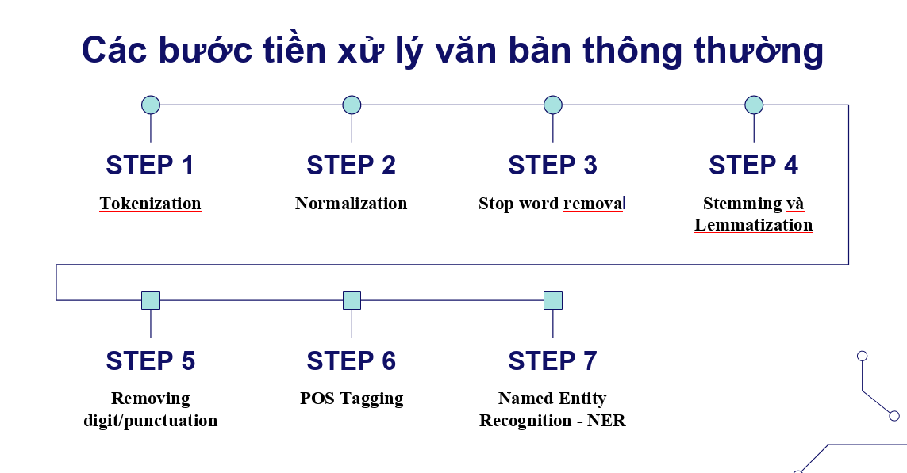
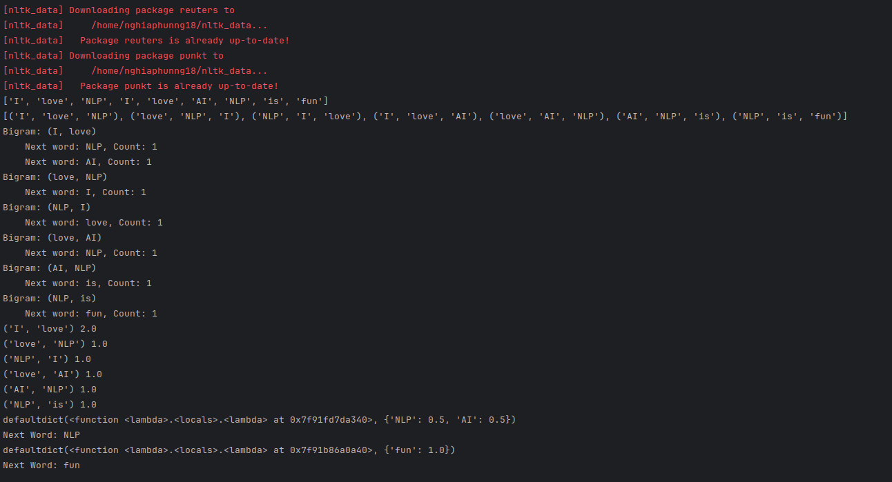

# [Mục lục](#muc-luc)
- [1.Giới thiệu chung về NLP](#1giới-thiệu-chung-về-nlp)
  - [1.1.Khái niệm cơ bản về NLP](#11khái-niệm-cơ-bản-về-nlp)
  - [1.2. Tại sao NLP quan trọng?](#12-tại-sao-nlp-quan-trọng)
  - [1.3. Các ứng dụng phổ biến của NLP](#13-các-ứng-dụng-phổ-biến-của-nlp)
- [2. Những khó khăn, thách thức trong NLP](#2-những-khó-khăn-thách-thức-trong-nlp)
  - [2.1. Độ phức tạp của ngôn ngữ tự nhiên](#21-độ-phức-tạp-của-ngôn-ngữ-tự-nhiên)
  - [2.2. Tính linh hoạt và thay đổi của ngôn ngữ](#22-tính-linh-hoạt-và-thay-đổi-của-ngôn-ngữ)
  - [2.3. Hạn chế của dữ liệu và mô hình NLP](#23-hạn-chế-của-dữ-liệu-và-mô-hình-nlp)
- [3.Các bước tiền xử lý văn bản](#3các-bước-tiền-xử-lý-văn-bản)
- [3.1.Tầm quan trọng của việc tiền xử lý văn bản](#31tầm-quan-trọng-của-việc-tiền-xử-lý-văn-bản)
- [3.2.Các bước tiền xử lý văn bản thông thường](#32các-bước-tiền-xử-lý-văn-bản-thông-thường)
- [4.Biểu diễn văn bản phù hợp với máy tính](#4biểu-diễn-văn-bản-phù-hợp-với-máy-tính)
  - [4.1.Khái niệm](#41khái-niệm)
  - [4.2.Các phương pháp biểu diễn văn bản phổ biến](#42các-phương-pháp-biểu-diễn-văn-bản-phổ-biến)
- [5.Các thư viện phổ biến trong NLP](#5các-thư-viện-phổ-biến-trong-nlp)
- [6.Demo: xây dựng pipeline tiền xử lý văn bản đơn giản](#6demo-xây-dựng-pipeline-tiền-xử-lý-văn-bản-đơn-giản)

# 1.Giới thiệu chung về NLP

## 1.1.Khái niệm cơ bản về NLP

- Xử lý Ngôn ngữ Tự nhiên (NLP): Lĩnh vực trong trí tuệ nhân tạo (AI) tập trung vào việc tương tác giữa máy tính và ngôn ngữ tự nhiên của con người.
- Mục tiêu: Giúp máy tính hiểu, diễn giải và phản hồi lại ngôn ngữ tự nhiên một cách hiệu quả.
- Các thức hoạt động: qua 3 bước chính
  - Tiền xử lý: Chuẩn hóa văn bản, loại bỏ nhiễu.
  - Hiểu văn bản: Phân tích từ, câu, cảm xúc.
  - Sinh văn bản: Tạo nội dung mới, dịch thuật.

## 1.2. Tại sao NLP quan trọng?

- Tự động hóa giao tiếp: Chatbot, trợ lý ảo.
- Xử lý dữ liệu lớn: Phân tích ý kiến khách hàng, dự đoán xu hướng.
- Ứng dụng đa ngành: Y tế, tài chính, giáo dục, marketing.

## 1.3. Các ứng dụng phổ biến của NLP

- Dịch máy: Google Translate, DeepL.
- Chatbot & Trợ lý ảo: Siri, Alexa, ChatGPT.
- Phân tích cảm xúc: Đánh giá sản phẩm, phản hồi trên mạng xã hội.
- Tóm tắt văn bản: Tóm tắt báo chí, tài liệu nghiên cứu.
- Nhận diện giọng nói: Google Voice, Apple Dictation.

# 2. Những khó khăn, thách thức trong NLP

## 2.1. Độ phức tạp của ngôn ngữ tự nhiên

- Tính đa nghĩa: Một từ/câu có thể có nhiều nghĩa. (VD: "bank" có thể là ngân hàng hoặc bờ sông.)
- Ngữ cảnh quan trọng: Nghĩa của từ thay đổi theo ngữ cảnh. (VD: "Anh ấy có một trái tim vàng" → Nghĩa bóng.)
- Cú pháp phức tạp: Câu có thể được hiểu theo nhiều cách. (VD: "Cô ấy nhìn thấy người đàn ông với chiếc kính viễn vọng.")
- Ngôn ngữ không chuẩn: Viết tắt, tiếng lóng, sai chính tả. (VD: "u" thay vì "you".)

## 2.2. Tính linh hoạt và thay đổi của ngôn ngữ

- Ngôn ngữ liên tục thay đổi: Xuất hiện từ mới, cách dùng mới. (VD: "selfie", "deepfake")
- Khác biệt giữa các ngôn ngữ: Cấu trúc và cú pháp khác nhau, khó áp dụng cùng một mô hình NLP.

## 2.3. Hạn chế của dữ liệu và mô hình NLP

- Dữ liệu không đầy đủ hoặc thiên vị: Mô hình có thể học theo thiên kiến xã hội. (VD: AI có thể phân biệt đối xử do dữ liệu không đa dạng.)
- Hiệu suất kém trên văn bản không chuẩn: NLP gặp khó khăn với văn bản viết sai chính tả, ngôn ngữ địa phương.

# 3.Các bước tiền xử lý văn bản

# 3.1.Tầm quan trọng của việc tiền xử lý văn bản

- Cải thiện chất lượng dữ liệu: Loại bỏ những từ không cần thiết và chuẩn hóa văn bản giúp cải thiện chất lượng dữ liệu đầu vào.
- Giảm độ phức tạp: Giảm kích thước từ vựng và làm cho văn bản dễ xử lý hơn.
- Tăng hiệu suất mô hình: Các mô hình NLP hoạt động hiệu quả hơn với dữ liệu đã được tiền xử lý.

# 3.2.Các bước tiền xử lý văn bản thông thường

- Tokenization: Chia văn bản thành các đơn vị nhỏ hơn gọi là token.
  - Phân đoạn câu (Sentence Tokenization): Chia văn bản thành các câu riêng lẻ.
    - Ví dụ: Văn bản "I love NLP. It is fascinating." sẽ được tách thành ["I love NLP.", "It is fascinating."].
  - Phân đoạn từ (Word Tokenization): Chia các câu thành các từ riêng lẻ.
    - Ví dụ: Câu "I love NLP." sẽ được tách thành ["I", "love", "NLP", "."].
- Normalization: Biến đổi văn bản thành một định dạng nhất quán.
  - Chuyển đổi thành chữ thường (Lowercasing): Chuyển tất cả văn bản thành chữ thường để đồng nhất và giảm độ phức tạp.
    - Ví dụ: "I LOVE NLP" sẽ được chuyển thành "i love nlp".
  - Loại bỏ dấu câu (Removing Punctuation): Loại bỏ các dấu câu không cần thiết.
    - Ví dụ: "Hello, world!" sẽ được chuyển thành "Hello world".
- Stop word removal: Loại bỏ các từ thông dụng trong ngôn ngữ như "the", "and", "a", v.v.
  - Ví dụ: Văn bản "This is a simple text" sẽ được chuyển thành "simple text".
- Stemming và Lemmatization:
  - Stemming: Loại bỏ hậu tố của từ để lấy gốc từ.
    - Ví dụ: "running", "runner" sẽ được chuyển thành "run".
  - Lemmatization: Giảm từ về dạng gốc dựa trên từ loại của chúng.
    - Ví dụ: "am", "are", "is" sẽ được chuyển thành "be".
- Removing digit/punctuation: Loại bỏ các chữ số và ký tự không cần thiết.
  - Ví dụ: "Hello, world! 123" sẽ được chuyển thành "Hello world".
- Gắn thẻ từ loại (POS Tagging): Gán một từ loại cho mỗi từ trong văn bản dựa trên ngữ cảnh và định nghĩa.
  - Ví dụ: "I love NLP" sẽ được gắn thẻ như sau: [('I', 'PRP'), ('love', 'VBP'), ('NLP', 'NN')].
- Nhận diện thực thể có tên (Named Entity Recognition - NER): Nhận diện và phân loại các thực thể có tên trong văn bản như người, tổ chức, và địa điểm.
  - Ví dụ: "Barack Obama was the 44th President of the USA" sẽ nhận diện và phân loại "Barack Obama" là một người và "USA" là một quốc gia.

# 4.Biểu diễn văn bản phù hợp với máy tính

## 4.1.Khái niệm

- Biểu diễn văn bản: là quá trình chuyển đổi văn bản thành một dạng mà máy tính có thể xử lý và hiểu được. Việc này rất quan trọng để áp dụng các thuật toán học máy và học sâu trong NLP.

## 4.2.Các phương pháp biểu diễn văn bản phổ biến

- One-Hot Encoding: Mỗi từ trong từ điển được biểu diễn bằng một vector nhị phân có đúng một giá trị 1 và các giá trị còn lại là 0.
  - Ví dụ: Với từ điển ["cat", "dog", "fish"], từ "cat" sẽ được biểu diễn thành [1, 0, 0].
- Bag of Words (BoW): Biểu diễn văn bản dưới dạng vector số đếm tần suất xuất hiện của từng từ trong từ điển.
  - Ví dụ: Với từ điển ["cat", "dog", "fish"], câu "cat dog dog" sẽ được biểu diễn thành [1, 2, 0].
- N-Grams: Biểu diễn văn bản bằng cách tạo ra các chuỗi liên tiếp của n từ liền kề nhau.
  - Ví dụ: Với văn bản "I love NLP", các 2-gram sẽ là ["I love", "love NLP"].
- TF-IDF (Term Frequency-Inverse Document Frequency): Biểu diễn văn bản bằng cách cân nhắc tần suất xuất hiện của từ trong văn bản và tần suất xuất hiện của từ đó trong toàn bộ tập dữ liệu.
  - Ví dụ: Một từ phổ biến như "the" sẽ có trọng số thấp hơn so với từ ít phổ biến hơn như "nlp".
- Word Embeddings (Embeddings từ): Biểu diễn từ bằng các vector trong không gian đa chiều, với các từ có ý nghĩa tương tự nằm gần nhau trong không gian vector.
  - Các kỹ thuật phổ biến:
    - Word2Vec: Sử dụng Skip-gram hoặc CBOW để tạo vector từ.
    - GloVe (Global Vectors for Word Representation): Dựa trên ma trận đồng xuất hiện để tạo vector từ.
    - fastText: Tạo vector từ dựa trên các n-gram ký tự.
  - Ví dụ: Vector từ của "king" - "man" + "woman" sẽ gần với vector từ của "queen".
- Pre-trained Embeddings (Embeddings tiền huấn luyện): Sử dụng các mô hình đã được huấn luyện trước trên các tập dữ liệu lớn để tạo vector từ.
  - Các mô hình phổ biến:
    - ELMo (Embeddings from Language Models): Tạo vector từ bằng cách sử dụng các mô hình ngôn ngữ.
    - BERT (Bidirectional Encoder Representations from Transformers): Tạo vector từ bằng cách sử dụng mô hình transformers.

# 5.Các thư viện phổ biến trong NLP

- Regex (Regular Expressions)

  - Tìm kiếm, trích xuất, làm sạch và xác thực dữ liệu văn bản dựa trên mẫu ký tự.
  - Không phải thư viện NLP chuyên dụng nhưng rất mạnh trong xử lý dữ liệu văn bản thô trước khi đưa vào NLP.

- NLTK (Natural Language Toolkit)
  - Hỗ trợ phân tích ngôn ngữ tự nhiên với các công cụ như tokenization, stemming, lemmatization, POS tagging, parsing, NER.
  - Phù hợp cho nghiên cứu và giáo dục về NLP, có thư viện rộng và nhiều bộ dữ liệu tích hợp.
- spaCy
  - Tokenization, NER, dependency parsing, POS tagging, word vectors.
  - Hiệu suất cao, tối ưu cho môi trường sản xuất, có các mô hình tiền huấn luyện mạnh mẽ.
- TextBlob
  - Sentiment analysis, POS tagging, noun phrase extraction, translation, text classification.
  - API đơn giản, dễ sử dụng, phù hợp cho người mới học NLP và prototyping nhanh.
- Textacy
  - Tiền xử lý văn bản, trích xuất đặc trưng ngôn ngữ, topic modeling, sentiment analysis, keyword extraction.
  - Xây dựng trên spaCy, cung cấp nhiều công cụ phân tích văn bản nâng cao và trực quan hơn.
- VADER (Valence Aware Dictionary and sEntiment Reasoner)
  - Phân tích cảm xúc dựa trên quy tắc (rule-based), tối ưu cho văn bản mạng xã hội.
  - Đặc điểm:
    - Sử dụng bộ từ điển cảm xúc (lexicon-based) với điểm số cảm xúc có sẵn.
    - Xử lý mức độ cảm xúc (sentiment intensity) chứ không chỉ phân loại tích cực/tiêu cực.
    - Nhận diện ngữ cảnh thay đổi cảm xúc (từ phủ định, từ nhấn mạnh).
    - Hỗ trợ biểu tượng cảm xúc (emoji, emoticon).
- Gensim
  - Thư viện mạnh mẽ cho mô hình chủ đề (topic modeling) và vector hóa văn bản.
  - Đặc điểm:
    - Tiền xử lý văn bản: Chuẩn hóa, tách từ, stemming, lemmatization.
    - Biểu diễn tài liệu dạng vector phục vụ nhóm cụm (clustering) và phân loại.
    - Nhúng từ (word embeddings): word2vec, GloVe giúp xác định quan hệ ngữ nghĩa.
    - Mô hình chủ đề (LDA, LSA, NMF) để khám phá nội dung chính của văn bản.
    - Tính toán độ tương đồng giữa các tài liệu phục vụ tìm kiếm thông tin.
- AllenNLP
  - Thư viện NLP mạnh mẽ trên nền tảng PyTorch, tập trung vào mô hình học sâu (deep learning).
  - Đặc điểm:
    - Có sẵn nhiều mô hình huấn luyện trước cho các tác vụ như phân loại văn bản, nhận diện thực thể (NER), gán vai trò ngữ nghĩa (SRL).
    - Tích hợp PyTorch, cho phép tùy chỉnh mô hình dễ dàng.
    - Cung cấp mô hình ELMo, giúp tạo vector từ theo ngữ cảnh, nâng cao độ chính xác trong NLP.
- Stanza (trước đây là StanfordNLP)
  - Thư viện Python chính thức cho Stanford CoreNLP, hỗ trợ đầy đủ các tác vụ NLP.
  - Đặc điểm:
    - Phân tích cú pháp (dependency parsing) mạnh mẽ, giúp hiểu quan hệ giữa các từ trong câu.
    - Nhận diện thực thể (NER) với độ chính xác cao.
    - Hỗ trợ nhiều ngôn ngữ, không chỉ tiếng Anh.
    - Xây dựng trên PyTorch, tối ưu hóa hiệu suất và khả năng tùy chỉnh.
- Pattern
  - Thư viện đơn giản nhưng đa năng cho NLP, khai thác web và machine learning.
  - Đặc điểm:
    - Cung cấp công cụ xử lý ngôn ngữ đơn giản như gán nhãn từ loại (POS tagging), lemmatization, phân tích cảm xúc.
    - Hỗ trợ dịch ngôn ngữ, hữu ích cho phân tích văn bản đa ngôn ngữ.
    - Tích hợp công cụ web scraping, giúp thu thập dữ liệu từ website.
    - Có sẵn các công cụ trực quan hóa dữ liệu, hữu ích cho việc phân tích và trình bày kết quả.
- PyNLPl
  - Chuyên về xử lý ngôn ngữ tự nhiên (NLP), đặc biệt là xử lý tập dữ liệu văn bản, phân tích hình thái và phân tích cú pháp.
  - Hỗ trợ đa ngôn ngữ và nhiều định dạng khác nhau.
- Hugging Face Transformers
  - Cung cấp mô hình Transformer đã được huấn luyện sẵn như BERT, GPT, RoBERTa.
  - Hỗ trợ tinh chỉnh mô hình, suy luận nhanh và tích hợp với PyTorch & TensorFlow.
  - Ứng dụng trong phân loại văn bản, trả lời câu hỏi, sinh văn bản, nhận diện thực thể.
- Flair
  - Sử dụng deep learning, tập trung vào nhận diện thực thể (NER), gán nhãn từ loại (POS), phân loại văn bản.
  - Hỗ trợ mô hình đa ngôn ngữ và theo từng lĩnh vực chuyên biệt.
  - Dễ sử dụng, cho phép tùy chỉnh và mở rộng mô hình.
- FastText
  - Tạo biểu diễn từ (word embeddings) và phân loại văn bản bằng mạng nơ-ron đơn giản.
  - Rất nhanh và tối ưu cho xử lý tập dữ liệu lớn.
  - Hỗ trợ nhiều ngôn ngữ, tốt cho nhận diện ngôn ngữ, phân loại tài liệu, phân tích cảm xúc.
- Polyglot
  - Hỗ trợ hơn 130 ngôn ngữ, phù hợp cho xử lý NLP đa ngôn ngữ.
  - Cung cấp công cụ tách từ (tokenization), nhận diện thực thể (NER), phân tích cảm xúc, dịch thuật.
  - Nhận diện ngôn ngữ chính xác cao với tập dữ liệu rộng lớn.

# 6.Demo: xây dựng pipeline tiền xử lý văn bản đơn giản

