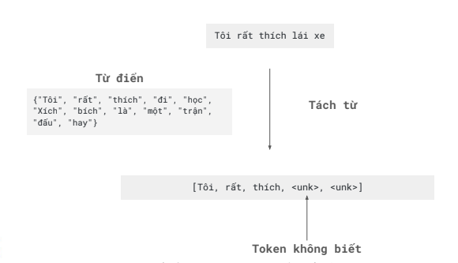

<h1 align="center"><strong>Tuần 2: Regular Expresssions and Tokenizer</strong><h1>

## Mục lục
- [Mục lục](#mục-lục)
- [Giới thiệu](#giới-thiệu)
- [Nội dung](#nội-dung)
  - [1.Biểu thức chính quy](#1biểu-thức-chính-quy)
    - [1.1.Các biểu thức hay dùng](#11các-biểu-thức-hay-dùng)
    - [1.2.Các mẫu cơ bản](#12các-mẫu-cơ-bản)
  - [2.Tách token (tokenizer)](#2tách-token-tokenizer)
    - [2.1.Thực hành tách từ với các thư viện khác nhau](#21thực-hành-tách-từ-với-các-thư-viện-khác-nhau)
    - [2.2.N grams](#22n-grams)
    - [2.3.Tách token hiện đại](#23tách-token-hiện-đại)
      - [2.3.1.Thuật toán tách token Byte-Pair Encoding (GPT sử dụng)](#231thuật-toán-tách-token-byte-pair-encoding-gpt-sử-dụng)
      - [2.3.2.Thuật toán tách token WordPiece (BERT sử dụng)](#232thuật-toán-tách-token-wordpiece-bert-sử-dụng)

## Giới thiệu
- Regular Expressions (Biểu thức chính quy)
- Các thuật toán tách từ
- Tài liệu học: 
  - https://regex101.com/
  - https://www.w3schools.com/python/python_regex.asp
  
## Nội dung
### 1.Biểu thức chính quy
#### 1.1.Các biểu thức hay dùng
- Tìm kiếm cơ bản
- Ký hiệu số lượng
- Đầu dòng cuối dòng 
- Toán tử chia cách, nhóm, ưu tiên
- Chuỗi đại diện
- Toán tử đếm

#### 1.2.Các mẫu cơ bản
- Tìm kiếm thông thường
  - Câu:  `con chó đang tung tăng vui vẻ trên đường`
    - Mẫu: con chó"
      - Kết quả: **con chó** đang tung tăng vui vẻ trên đường
      - Nhận xét: Mẫu tìm chuỗi con theo đúng thứ tự các ký tự
    - Mẫu t:
      - Con chó đang **t**ung **t**ăng vui vẻ **t**rên đường
- Regular Expression: phân biệt dấu hoa dấu thường
  - Cho nên nễu mẫu là Con chó sẽ không khớp với chuỗi con chó trong câu
  - Để giải quyết vấn đề hoa thường bạn có thể sử dụng ngoặc **[]** cho việc lựa chọn, lúc này mẫu sẽ trở thành: [Cc]on chó
    - **Con chó** đang tung tăng vui vẻ trên đường
    - **con chó** đang tung tăng vui vẻ trên đường
- Mẫu `[123456789]` có hạn chế về việc khoảng rộng cho nên có thể sử dụng dấu `-` để tìm trong đoạn dài ví dụ `[1-9]`
  - Mẫu `[1-9]` sẽ trả ra kết quả
    - tin anh đi **9** năm nữa anh sẽ trở thành **1** tỷ phú
  - Có thể cân nhắc sử dụng `\d` để đại diện 1 chữ số bất kì
  - Tuy nhiên, mẫu range này chỉ hoạt động nếu sử dụng bắt đầu và kết thúc duy nhất **một** chữ số
- Mẫu [a-zA-z] : chữ cái tiếng anh
- Ký hiệu `^` đứng trong mẫu `[]` có ý nghĩa là **không phải**
  - Ví dụ: 
    - `[^a-z]` có nghĩa là không phải các ký tự chữ cái tiếng anh thường
    - `[^Ss]` trả về các ký tự không phải S hoặc s
  - Chú ý: chỉ hoạt động khi đứng ở đâu, còn không đem xem như ký tự `^` được chọn bình thường
    - Ví dụ: `[a-z^A-Z]
- Ký hiệu số lượng
  - Ký hiệu `?`
    - Ý nghĩa: không hoặc có một ký tự phía trước ký hiệu `?`
    - Ví dụ: `a?m` có thể tìm ra `m` hoặc `am`
    - `phu?` có thể tìm ra `phu` hoặc `ph`
  - Ký hiệu `*`
    - Ý nghĩa: không hoặc có nhiều ký tự phía trước ký hiệu `*`
    - Ví dụ: `a*m` có thể tìm ra `m`, `am`, `aaam`, hoặc `aaaaaam`
    - Tuy nhiên `a*` sẽ khớp với chuỗi rỗng
    - Phức tạp hơn ta sẽ có `[em]*` có nghĩa **không có hoặc có nhiều e hoặc nhiều m**. Khớp với `eeee`, `mmmm`, `emememem` và cuối cùng là chuỗi rỗng
  - Ký hiệu `+`
    - Ý nghĩa: có một hoặc nhiều ký tự phía trước ký hiệu + (ít nhất một)
    - Ví dụ: `a+m` sẽ không khớp với `m` ví bắt buộc phải có ít nhất một `a`. Mẫu này khớp vói `am`, `aam`, `aaam` hoặc `aaaaam`
- Ký hiệu đầu dòng - cuối dòng
  - Ký hiệu `^` thể hiện bắt đầu 1 dòng
    - `^T` sẽ khớp với: **T**a đi
    - Kết luận ký hiệu này có 3 ý nghĩa:
      - Nếu ở trong `[]` : có nghĩa là ngoại trừ, phủ định
      - Nếu ở ngoài `[]` : có nghĩa là bắt đầu câu 
      - Nếu đứng sau `\` : có nghĩa là ký tự `^`
  - Ký hiệu `$` thể hiện kết thúc dòng
    - `p$` sẽ khớp với: hoa đẹ**p**
  - `\b` : là biên của từ
    - `\bchúa\b` sẽ khớp với: Công **chúa** ngủ trong rừng
    - Chú ý: `\b122\b` khớp: số **122** nhưng nhưng `\b22\b` lại không khớp với số 1**22**
  - `\B` : là biên không phải từ
    - `\B-\b` sẽ khớp với: `Bá Ngọc **-** lazy boy` 
- Toán tử chia cách, nhóm, ưu tiên
  - Toán tử chia cách (Disjunction)
    - Bạn muốn tìm từ `vàng` hoặc `kim cương`. Bạn có thể sử dụng toán tử `|` như sau: `vàng|kim cương`
    - Ví dụ: **Quyên** và **Quyền** bạn cần sử dụng `()` với mẫu `Quy(ên|ền)`
  - Phép ưu tiên: **thứ tự ưu tiên giảm dần**
    - Ngoặc tròn **()**
    - Bộ đếm
      - toán tử **\***
      - toán tử **+**
      - toán tử **?**
      - số lượng xuất hiện **{}**
    - Chuối và mỏ neo: `ánh ^hoàng hôn$`
    - Phép hoặc `|`
    - Ví dụ mẫu `(hoàng)*` sẽ có thứ tự ưu tiên sau
      - () sẽ coi **hoàng** là một ký tự
      - * sẽ đếm có bao nhiêu ký tự trong **()**
      - Kết quả: **hoàng** **hoàng** hôn
- Chuỗi đại diện
  - `\d` : đại diện cho mọi số bất kỳ
  - `\D` : đại diện cho mọi ký tự không phải số
  - `\w` : đại diện cho chữ/ số/ gạch chân. Chữ này trong bảng tiếng anh
  - `\W` : đại diện cho khôn phải chữ/ số/ gạch chân
  - `\s` : đại diện cho không phải khoảng trắng
- Toán tử đếm:
  - `*` : không hoặc nhiều ký tự phía trước
  - `+` : một hoặc nhiều ký tự phía trước
  - `?` : không hoặc một ký tự phía trước
  - `{n}` : chính xác n lần xuất hiện của ký tự phía trước
  - `{n,m}`: n đến m lần xuất hiện của ký tự phía trước
  - `{n,}` : ít nhất n lần xuất hiện của ký tự phía trước
  - `{,m}` : tối đa m lần xuất hiện của ký tự phía trước
- Loại bỏ ký tự đặc biệt
  - `\*`
    - Dấu **\*** bình thường 
    - Mẫu `\*` khớp: Mật khẩu hiện tại **\*\*\*\***
  - `\.`
    - Dấu **.** bình thường
    - Mẫu `\.` khớp: Chấm câu sắp tới **.** Lại chấm câu **.**
  - `\?`
    - Dấu **?** bình thường
    - Mẫu `\?` khớp: Sắp đến Noel chưa **?**
  - `\n`
    - Xuống dòng
  - `\t`
    - Tab
  - `\/`
    - Dấu `/` bình thường

### 2.Tách token (tokenizer)
- Tách token là nhiệm vụ tách câu thành những đơn vị nhỏ (token)
- Đơn vị (token) có thể là: cụm nhiều từ, từ, cụm ký tự
- Thuật toán tách token là chia các văn bản thành nhiều đơn vị nhỏ (token) nhằm số hóa chúng sau đó đưa dữ liệu này vào đào tạo các mô hình
- Vấn đề của tách từ: chưa khai phá được bản chất của từ ngữ được hình thành bởi những cụm ký tự giống nhau
    
  - Giả sử với một ví dụ: `hích, tích, thích`
    - Điểm chung: đều được hình thành khi có nhóm ký tự "ích"
    - Đây là một hình vị (morpheme) - đơn vị có ý nghĩa nhỏ nhất trong ngôn ngữ
    - Vì vậy sẽ tốt hơn nếu ta coi "ích" là một token?
      - Từ điển tách từ: `{"hích", "tích", "thích"}`
      - Từ điển tách token: `{"h", "t", "ích"}`
      - Khi số lượng văn bản trong ngữ liệu lớn tới vô cùng, **từ điển tách từ" sẽ có số lượng lớn hơn
- **Từ điển tách token**
  - Ưu điểm:
    - Mô phỏng được mối quan hệ hình thành từ thông qua các token phổ biến
    - Kích cỡ từ điển dùng tách token sẽ nhỏ đi so với từ điển tách từ khi ngữ liệu tăng lên
  - Nhược điểm:
    - Thuật toán tách token phức tạp hơn thuật toán tách từ
- Hugging Face: thư viện tập trung vào các công nghệ **Xử lý ngôn ngữ tự nhiên (NLP)** và các mô hình dựa trên **Transformer**
  - Thư viện Transformers: cho phép xây dựng nhanh các mô hình đúng kiến trúc Transformer 
  - Model Hub: BERT, GPT, RoBERTa
  - Tokenizers: đa dạng các bộ tách từ
#### 2.1.Thực hành tách từ với các thư viện khác nhau
#### 2.2.N grams
- Một n-gram là một các các từ **liên tiếp nhau**
  - Ví dụ: `học Tiếng Việt rất`
    
#### 2.3.Tách token hiện đại 
##### 2.3.1.Thuật toán tách token Byte-Pair Encoding (GPT sử dụng)
- Công thức của thuật toán
  - Khởi tạo từ điển V chứa tất cả các ký tự của ngữ liệu 
  - LẶp từ 1 đến k
    - Tìm ra cặp 2 token xuất hiện nhiều nhất trong ngữ liệu
    - Nối 2 token này với nhau thành token mới token_new
    - Thêm token_new vào từ điển V
    - Thay thế cặp 2 token ban đầu bằng token_new ở mọi nơi trong ngữ liệu
  - Kết quả thu được từ điển V
  
##### 2.3.2.Thuật toán tách token WordPiece (BERT sử dụng)