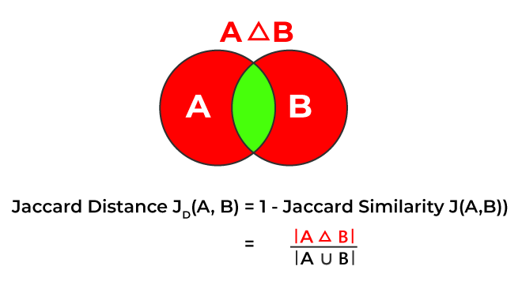
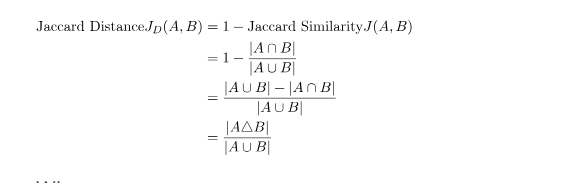
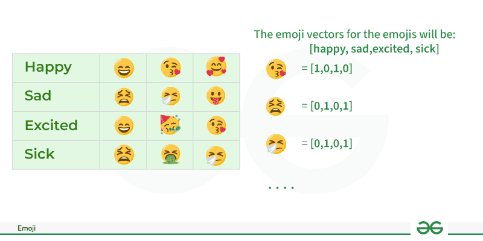
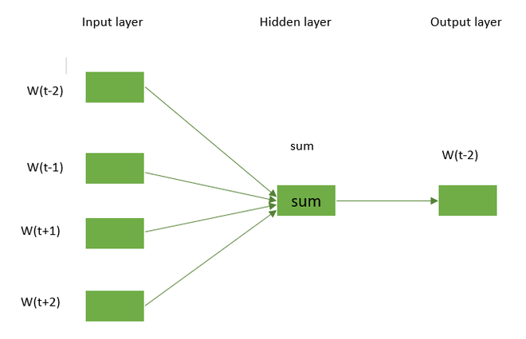
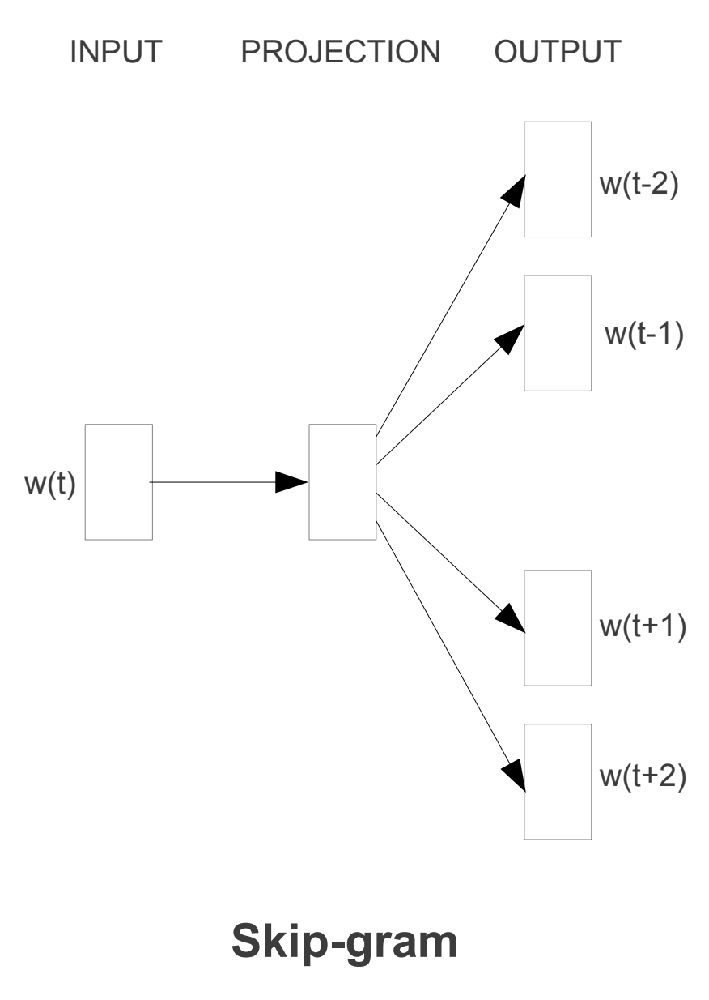

<h1 align="center"><strong><span style="color: red;">Tuần 3: Text Normalization and Vector Semantics, Embeddings</span></strong><h1>

### Mục lục
- [Mục lục](#mục-lục)
- [1. Chuẩn hóa văn bản (Text Normalization)](#1-chuẩn-hóa-văn-bản-text-normalization)
- [2. Vector Embddings](#2-vector-embddings)
- [3. Tổng quan Word Embddings (Phần bổ sung)](#3-tổng-quan-word-embddings-phần-bổ-sung)
  - [3.1 Word Embeddings trong NLP là gì?](#31-word-embeddings-trong-nlp-là-gì)
  - [3.2 Tại sao cần Word Embedding?](#32-tại-sao-cần-word-embedding)
  - [3.3 Word Embeddings được sử dụng như thế nào?](#33-word-embeddings-được-sử-dụng-như-thế-nào)
  - [3.4 Các phương pháp biểu diễn văn bản](#34-các-phương-pháp-biểu-diễn-văn-bản)
    - [3.4.1 Phương pháp truyền thống](#341-phương-pháp-truyền-thống)
      - [3.4.1.1 One-Hot Encoding](#3411-one-hot-encoding)
      - [3.4.1.2 Bag of Word (BoW)](#3412-bag-of-word-bow)
      - [3.4.1.3 Term frequency-inverse document frequency (TF-IDF)](#3413-term-frequency-inverse-document-frequency-tf-idf)
    - [3.4.2 Tiếp cận bằng mạng Nơ-ron](#342-tiếp-cận-bằng-mạng-nơ-ron)
      - [3.4.2.1 Word2Vec](#3421-word2vec)
      - [3.4.2.2 Continuous Bag of Words (CBOW)](#3422-continuous-bag-of-words-cbow)
      - [3.4.2.3 Skip-gram](#3423-skip-gram)
    - [3.4.3 Pretrained Word Embeddings](#343-pretrained-word-embeddings)
      - [3.4.3.1 GloVe](#3431-glove)
      - [3.4.3.2 Fasttext](#3432-fasttext)
      - [3.4.3.3 BERT (Bidirectional Encoder Representations from Transformers)](#3433-bert-bidirectional-encoder-representations-from-transformers)
  
### 1. Chuẩn hóa văn bản (Text Normalization)
- Chuẩn hóa văn bản là một chuỗi việc chuyển văn bản sang **dạng chuẩn**, **thuận tiện** để sử dụng trong các bài toán khác nhau:
  - **Bài toán sinh từ** (Text Generation) : giữ nhiều token nhất có thể, đưa vào các văn bản về chung một format. Ví dụ lùi đầu dòng, viết hoa đầu câu
  - **Bài toán phân loại cảm xúc** (Sentiment Classification) : loại bỏ những stop-words như the, a, to,... Giữ lại biểu tượng cảm xúc như :), :D
- Sentence segmentation (Tách câu) : chia văn bản thành các câu. Việc chia này có thể dựa vào dấu ".", "?", "!". Vấn đề khó khăn xảy ra như từ viết tắt trong Tiếng Anh sử dụng dấu chấm, ví dụ như Mr. hay Mrs.
- Tokenization (Tách token) : Chia văn bản thành các token 
- Lematization (Đưa về dạng từ gốc) : là việc xác định từ gốc của các từ
  - Ví dụ: say, said, saying -> **say**
  - Ưu điểm:  
    - Tìm kiếm tốt hơn: khi người dùng tìm kiếm văn bản từ **sing**, thuật toán có thể cùng tìm thêm từ **sang**, **sung**
    - Phân loại tốt hơn: chuẩn hóa về từ gốc giúp thu hẹp không gian phân tích và tạo ra độ chính xác cao hơn
  - Nhược điểm:
    - Đánh mất thông tin ngữ pháp: nếu bộ dữ liệu có sự mập mờ lớn thì việc xử lý này sẽ đánh mất thông tin ngữ pháp làm giảm độ chính xác của mô hình
  - Một số thư viện hay dùng
    - Natural Language Toolkit: https://www.nltk.org/
    - spaCy: https://spacy.io/
    - TextBlob: https://textblob.readthedocs.io/en/dev/
    - Stanford CoreNLP: https://stanfordnlp.github.io/CoreNLP/
- Stemming : Cắt hậu tố khỏi từ. Ít được sử dụng hơn Lemmzatiazation
- Lọc stop words : Lọc những từ hay xuất hiện và ít ngữ nghĩa như "the", "is", "at", "on", "which",...
- Word Correction (Sửa sai từ) : sai thứ tự chữ trong từ Tiếng Anh hoặc sai dấu trong Tiếng Việt
  - Ví dụ: happpy -> happy, azmaing -> amazing, intelliengt -> intelligent
  - Tìm từ trong từ điển từ có **khoảng cách** gần nhất. Khoảng cách này có thể sử dụng Edit Distance hoặc Jaccard Distance
  - Quy trình sửa từ:
    - Lặp qua các từ trong từ điển
    - Tính khoảng cách của các từ này với từ mục tiêu (từ đang nhập)
    - Từ nào trong từ điển có **khoảng cách ngắn nhất** thì đề xuất từ đó là từ thay thế
      - Jaccard Distance
        
        
      - Edit Distance: hay còn gọi là Levenshtein distance, đo lường **tổng số phép nhỏ nhất** càn thực hiện để biến chuỗi A thành chuỗi B
        - Có 3 phép bao gồm:
          - Phép chèn (Insertion)
          - Phép xóa (Deletion)
          - Phép thay thế (Substitution)
        - Ví dụ: kitten -> sitting
          - Edit distance bằng 3, **cần ít nhất 3 phép** để chuyển **kitten** thành **sitting**
            - Thay 'k' bằng 's' (kitten -> sitten)
            - Thay 'e' bằng 'i' (sitten -> sittin)
            - Thay 'g' ở cuối (sittin -> sitting)

### 2. Vector Embddings
- Giả thiết phân phối: những từ xuất hiện trong **cùng ngữ cảnh** có xu hướng **cùng ý nghĩa**
- Lexical Semantics
  - Phân tích đại diện ngữ nghĩa trên đơn vị là **từ - word meaning** (nghiên cứu về ý nghĩa của một từ, và hệ thống kết nối quan hệ ý nghĩa của một từ)
    - Sự tương đồng về ngữ nghĩa (word similarity): **chó** và **mèo**
    - Từ đồng nghĩa (synonyms): **hạnh phúc** và **sung sướng**
    - Từ trái nghĩa (antonym): **ngắn** và **dài**
    - Hàm ý tích cực/ tiêu cực (positive/negative connotations): **hạnh phúc** và **đau khổ**
    - Trường ngữ nghĩa (semantic field): **marketing, kinh doanh, chi phí, lợi nhuận** cùng thuộc trường ngữ nghĩa **kinh tế**
- Sự tương đồng về ngữ nghĩa giữa các tù (word similarity) :
  - Ví dụ: mặc dù "mèo" **không phải** từ **đồng nghĩa** (synonymy) với "chó", tuy nhiên 2 từ này có sự tương đồng về **ngữ nghĩa** (similarity)
  - Việc mở rộng phạm vi đánh giá 2 từ thay vì sử dụng mối quan hệ **word senses** (đồng nghĩa/ trái nghĩa) sang mối quan hệ tương đồng (**word similarity**) làm **đơn giản độ phức tạp của bài toán**
- Vector ngữ nghĩa (Semantic Vector)
  - Ngữ nghĩa của một từ được định nghĩa thông qua **phân bố** (distribution) của nó trong việc sử dụng ngôn ngữ
  - Hai từ cùng phân **phân bố** (similar distribution - các từ xung quanh tương đồng nhau) sẽ có ngữ nghĩa giống nhau
  -> Ý tưởng của **Vector ngữ nghĩa** là biểu diễn một từ dưới dạng **không gian ngữ nghĩa nhiều chiều (multidimensional semantic space),** không gian này được xây dựng dựa trên mối quan hệ với các từ xung quanh
- Embeddings
  - Là tập hợp các vector ngữ nghĩa
  - học được từ bài toán phân loại (classification)
  - Những thuật toán NLP hiện tại sử dụng để biểu diễn ngữ nghĩa của từ
  - Embeddings Types
    - TF IDF
      - Vector thưa (Sparse Vector): có rất nhiều **giá trị 0**
      - Vector có chiều bằng số lượng từ trong từ điển
      - Một từ được biểu diễn thông qua **số từ** xung quanh nó
      - Thường được sử dụng như một baseline model
    - Word2Vec
      - Vector dày (Dense Vector)
      - Vector có chiều nhỏ do ta định nghĩa
      - Xây dựng bằng mô hình phân loại tính **xác suất xuất hiện các từ xung quanh**
  - Tính tương đồng (cosin similarity): những từ **càng tương đồng nhau** thì góc giữa vector embedding của 2 từ này **sẽ càng nhỏ**
- Word Embeddings
  - Mô phỏng từ bằng vector nhiều chiều, những từ tương đồng nhau thì vector sẽ **gần nhau**
  - Word Embeddings được sử dụng để **biểu diễn từ** trước khi đưa vào các model NLP
  - Vector ngắn và dày (shor dense vector)
    - Dense Vector (ví dụ 300 chiều) hoạt động tốt hơn Sparse Vector (ví dụ 1000 chiều) trong các NLP task vì Dense Vector yêu cầu ít params hơn giúp giảm test error (generation error) - **tránh overfitting**
    - Sparse Vector **yếu** trong việc mô tả tương đồng ngữ nghĩa, ví dụ 2 vector của từ "gà" và "động vật" có thể **hoàn toàn khác nhau**
- Word2Vec
  - Là một embedding tĩnh (static embedding), một từ được biểu diễn dưới dạng một vector cố định (fixed embedding)
  - Những embedding tiên tiến hiện nay như **BERT** hoặc **ELMO** biểu diễn từ dưới dạng vector ngữ cảnh động (dynamic contextual embedding), tức là một từ sẽ có **biểu diễn khác nhau trong những ngữ cảnh khác nhau**
    - Ví dụ: "Ông gìa đi nhanh quá" thì từ "đi" có thể được hiểu bởi 3 ý nghĩa khác nhau hoặc có thể hơn thế nữa

### 3. Tổng quan Word Embddings (Phần bổ sung)
#### 3.1 Word Embeddings trong NLP là gì?
- Là một phương pháp biểu diễn từ và văn bản. Word Embedding (hay còn gọi là Word Vector) là một vector số được sử dụng làm đầu vào, biểu diễn một từ trong không gian có số chiều thấp hơn. Phương pháp này giúp các từ có ý nghĩa tương tự được biểu diễn theo cách giống nhau.
- Là một phương pháp trích xuất đặc trưng từ văn bản để có thể đưa các đặc trưng đó vào mô hình học máy nahwfm xử lý dữ liệu văn bản. Chúng cố gắng bảo toàn thông tin cú pháp và ngữ nghĩa. 
- Các phương pháp như **Bag of Words (BOW), CountVectorizer và TF-IDF** chỉ dựa trên số lần xuất hiện của từ trong câu nhưng không lưu giữ thông tin cú pháp hay ngữ nghĩa. Trong các thuật toán này, kích thước của vector chính là số lượng từ trong từ vựng. Điều này có thể dẫn đến một ma trận thưa (sparse matrix), nơi phần lớn phần tử có giá trị bằng 0. Các vector đầu vào có kích thước lớn sẽ dẫn đến số lượng trọng số khổng lồ, từ đó làm tăng yêu cầu tính toán khi huấn luyện mô hình.
- **Word Embeddings** giúp giải quyết các vấn đề này bằng cách biểu diễn từ trong không gian có số chiều thấp hơn, đồng thời bảo toàn thông tin ngữ nghĩa và cú pháp.

#### 3.2 Tại sao cần Word Embedding?
- Giảm số chiều: Giúp biểu diễn từ trong không gian có số chiều thấp hơn, tránh ma trận thưa (sparse matrix).
- Dùng một từ để dự đoán các từ xung quanh: Giúp mô hình hiểu được ngữ cảnh của từ.
- Nắm bắt mối quan hệ ngữ nghĩa giữa các từ: Giúp từ có ý nghĩa tương tự có vector gần nhau trong không gian vector.

#### 3.3 Word Embeddings được sử dụng như thế nào?
- Được sử dụng làm đầu vào cho các mô hình học máy.
- Quy trình cơ bản: Lấy từ → Chuyển thành biểu diễn số → Dùng trong huấn luyện hoặc suy luận.
- Dùng để biểu diễn hoặc trực quan hóa các mẫu ẩn trong tập dữ liệu văn bản mà mô hình đã được huấn luyện.

Ví dụ 

#### 3.4 Các phương pháp biểu diễn văn bản
##### 3.4.1 Phương pháp truyền thống 
- Phương pháp thông thường liên quan đến việc tạo danh sách các từ riêng biệt và gán cho mỗi từ một giá trị số nguyên duy nhất, hoặc id. Sau đó, chèn id duy nhất của mỗi từ vào câu. Trong trường hợp này, mỗi từ trong từ vựng được coi là một đặc trưng. Do đó, một từ vựng lớn sẽ dẫn đến kích thước đặc trưng rất lớn.
- Các phương pháp truyền thống phổ biến bao gồm:
###### 3.4.1.1 One-Hot Encoding
- Là một phương pháp đơn giản để biểu diễn từ trong xử lý ngôn ngữ tự nhiên (NLP)
- Trong code mẫu, mỗi từ trong từ vựng được biểu diễn dưới dạng một vector duy nhất, trong đó số chiều của vector bằng với kích thước của từ vựng
- Vector có các phần tử được đặt thành 0, ngược trừ phần tử tương ứng với chỉ mục của từ trong từ vựng được đặt thành 1
- Ví dụ về one-hot encoding:
  ```
  def one_hot_encode(text):
    words = text.split()
    vocabulary = set(words)
    word_to_index = {word: i for i, word in enumerate(vocabulary)}
    one_hot_encoded = []
    for word in words:
      one_hot_vector = [0] * len(vocabulary)
      one_hot_vector[word_to_index[word]] = 1
      one_hot_encoded.append(one_hot_vector)

    return one_hot_encoded, word_to_index, vocabulary

  example_text = "cat in the hat dog on the mat bird in the tree"

  one_hot_encoded, word_to_index, vocabulary = one_hot_encode(example_text)

  print("Vocabulary:", vocabulary)
  print("Word to Index Mapping:", word_to_index)
  print("One-Hot Encoded Matrix:")
  for word, encoding in zip(example_text.split(), one_hot_encoded):
    print(f"{word}: {encoding}")

  ```
- Ouput:
  ```
  Vocabulary: {'mat', 'the', 'bird', 'hat', 'on', 'in', 'cat', 'tree', 'dog'}
  Word to Index Mapping: {'mat': 0, 'the': 1, 'bird': 2, 'hat': 3, 'on': 4, 'in': 5, 'cat': 6, 'tree': 7, 'dog': 8}
  One-Hot Encoded Matrix:
  cat: [0, 0, 0, 0, 0, 0, 1, 0, 0]
  in: [0, 0, 0, 0, 0, 1, 0, 0, 0]
  the: [0, 1, 0, 0, 0, 0, 0, 0, 0]
  hat: [0, 0, 0, 1, 0, 0, 0, 0, 0]
  dog: [0, 0, 0, 0, 0, 0, 0, 0, 1]
  on: [0, 0, 0, 0, 1, 0, 0, 0, 0]
  the: [0, 1, 0, 0, 0, 0, 0, 0, 0]
  mat: [1, 0, 0, 0, 0, 0, 0, 0, 0]
  bird: [0, 0, 1, 0, 0, 0, 0, 0, 0]
  in: [0, 0, 0, 0, 0, 1, 0, 0, 0]
  the: [0, 1, 0, 0, 0, 0, 0, 0, 0]
  tree: [0, 0, 0, 0, 0, 0, 0, 1, 0]
  ```
- Nhược điểm:
  - One-hot encoding tạo ra các vector có chiều cao, làm cho quá trình tính toán trở nên tốn kém và tiêu tốn nhiều bộ nhớ, đặc biệt khi từ vựng lớn.
  - Nó không thể nắm bắt được mối quan hệ ngữ nghĩa giữa các từ; mỗi từ được xử lý như một thực thể độc lập mà không xét đến ý nghĩa hay ngữ cảnh của nó.
  - Nó bị giới hạn trong tập từ vựng đã thấy trong quá trình huấn luyện, khiến nó không phù hợp để xử lý các từ nằm ngoài tập từ vựng.

###### 3.4.1.2 Bag of Word (BoW)
- Là một kỹ thuật biểu diễn trong văn bản, trong đó một tài liệu được biểu diễn dưới dạng một tập hợp không có thứ tự của các từ và tần suất xuất hiện của chúng. Phương pháp này bỏ qua thứ tự từ trong câu và chỉ ghi nhận tần suất xuất hiện của từng từ trong tài liệu, tạo ra một biểu diễn dưới dạng vector.
- Ví dụ:
  ```
  from sklearn.feature_extraction.text import CountVectorizer

  documents = ["This is the first document.",
                "This document is the second document.",
                "And this is the third one.",
                "Is this the first document?"]

  vectorizer = CountVectorizer()
  X = vectorizer.fit_transform(documents)
  feature_names = vectorizer.get_feature_names_out()

  print("Bag-of-Words Matrix:")
  print(X.toarray())
  print("Vocabulary (Feature Names):", feature_names)
  ```
- Output: 
  ```
  Bag-of-Words Matrix:
  [[0 1 1 1 0 0 1 0 1]
   [0 2 0 1 0 1 1 0 1]
   [1 0 0 1 1 0 1 1 1]
   [0 1 1 1 0 0 1 0 1]]
  Vocabulary (Feature Names): ['and' 'document' 'first' 'is' 'one' 'second' 'the' 'third' 'this']
  ```
- Mặc dù BoW là một phương pháp đơn giản và dễ hiểu, nhưng những nhược điểm dưới đây cho thấy các hạn chế của nó trong việc nắm bắt một số khía cạnh về cấu trúc ngôn ngữ và ngữ nghĩa:
  - BoW bỏ qua thứ tự của các từ trong tài liệu, dẫn đến mất thông tin về trình tự và ngữ cảnh, khiến phương pháp này kém hiệu quả hơn đối với các nhiệm vụ yêu cầu thứ tự từ quan trọng, chẳng hạn như trong lĩnh vực hiểu ngôn ngữ tự nhiên.
  - Biểu diễn BoW thường thưa thớt (sparse), với nhiều phần tử có giá trị bằng 0, làm tăng nhu cầu về bộ nhớ và gây kém hiệu quả trong tính toán, đặc biệt là khi xử lý tập dữ liệu lớn.

###### 3.4.1.3 Term frequency-inverse document frequency (TF-IDF)
- Là một thống kê số học phản ánh mức độ quan trọng của một từ trong một tài liệu so với toàn bộ tập hợp tài liệu (corpus)
- Được sử dụng rộng rãi trong xử lý ngôn ngữ tự nhiên và truy xuất thông tin để đánh giá mức độ quan trọng của một thuật ngữ trong một tài liệu cụ thể thuộc về một tập hợp tài liệu lớn hơn
- Bao gồm 2 nhánh chính
  - Term Frequency - TF : Đo lường tần suất một thuật ngữ (từ) xuất hiện trong một tài liệu (document). Công thức như sau: TF(t, d) = (Số lần xuất hiện từ t) / (Tổng số từ)
    ```
    def tf(term, doc):
      result = 0
      for word in doc:
          if word == term:
              result += 1
      return result / len(doc)
    ```
  - IDF( Invert Document Frequency) : Dùng để đánh giá mức độ quan trọng của 1 từ trong văn bản. Khi tính tf múc độ quan trọng của các từ là như nhau. Tuy nhiên trong văn bản thường xuất hiện nhiều từ không quan trọng xuất hiện với tần suất cao:
    - Từ nối : và, hoặc, ....
    - Giới từ: ở, trong, của, để, ....
    - Từ chỉ định: ấy, đó, nhỉ
    - Chính vì thế cần giảm đi mức độ quan trọng của những từ đó bằng IDF
    - IDF(t, D) = log_e(Số văn bản trong tập D /Số văn bản chứa từ t trong tập D)
      ```
      def idf(term, docs):
        result = 0
        for doc in docs:
            for word in doc:
                if word == term:
                    result += 1
                    break
        return math.log(len(docs) / result, math.e)
      ```
- TF-IDF : TF-IDF(t, d, D) = TF(t, d) * IDF(t, D)
  ```
  def tf_idf(term, doc, docs):
    return tf(term, doc) * idf(term, docs)
  ```
- Giá trị TF-IDF càng cao thì thuật ngữ đó càng quan trọng đối với tài liệu trong ngữ cảnh của toàn bộ tập hợp tài liệu. Cách tiếp cận này giúp xác định và trích xuất thông tin quan trọng từ một tập hợp tài liệu lớn, được sử dụng phổ biến trong khai phá văn bản (text mining), truy xuất thông tin (information retrieval) và phân cụm tài liệu (document clustering).
- Demo ví dụ:
  ```
  from sklearn.feature_extraction.text import TfidfVectorizer

  # Sample
  documents = [
    "The quick brown fox jumps over the lazy dog.",
    "A journey of a thousand miles begins with a single step.",
  ]

  vectorizer = TfidfVectorizer() # Create the TF-IDF vectorizer
  tfidf_matrix = vectorizer.fit_transform(documents)
  feature_names = vectorizer.get_feature_names_out()
  tfidf_values = {}

  for doc_index, doc in enumerate(documents):
    feature_index = tfidf_matrix[doc_index, :].nonzero()[1]
    tfidf_doc_values = zip(feature_index, [tfidf_matrix[doc_index, x] for x in feature_index])
    tfidf_values[doc_index] = {feature_names[i]: value for i, value in tfidf_doc_values}
  #let's print
  for doc_index, values in tfidf_values.items():
    print(f"Document {doc_index + 1}:")
    for word, tfidf_value in values.items():
      print(f"{word}: {tfidf_value}")
    print("\n")
  ```
- Output:
  ```
  Document 1:
  the: 0.6030226891555273
  quick: 0.30151134457776363
  brown: 0.30151134457776363
  fox: 0.30151134457776363
  jumps: 0.30151134457776363
  over: 0.30151134457776363
  lazy: 0.30151134457776363
  dog: 0.30151134457776363


  Document 2:
  journey: 0.3535533905932738
  of: 0.3535533905932738
  thousand: 0.3535533905932738
  miles: 0.3535533905932738
  begins: 0.3535533905932738
  with: 0.3535533905932738
  single: 0.3535533905932738
  step: 0.3535533905932738
  ```
- Nhận xét: TF-IDF là một kỹ thuật được sử dụng rộng rãi trong truy xuất thông tin và khai thác dữ liệu văn bản, nhưng nó cũng có những hạn chế cần được xem xét, đặc biệt là khi xử lý các tác vụ yêu cầu hiểu sâu về ngữ nghĩa của ngôn ngữ. Ví dụ: 
  - TF-IDF coi các từ là các thực thể độc lập và không xét đến mối quan hệ ngữ nghĩa giữa chúng. Hạn chế này khiến TF-IDF không thể nắm bắt thông tin ngữ cảnh cũng như ý nghĩa của từ
  - Nhạy cảm với độ dài của văn bản: Các văn bản dài thường có xu hướng có tổng số lần xuất hiện của từ cao hơn, điều này có thể khiến TF-IDF thiên vị đối với các văn bản dài hơn

##### 3.4.2 Tiếp cận bằng mạng Nơ-ron
###### 3.4.2.1 Word2Vec 
- Là một phương pháp dựa trên mạng nơ-ron để tạo ra biểu diễn từ dưới dạng nhúng (word embeddings). Đây là một kỹ thuật thuộc nhóm mô hình biểu diễn phân tán (distributed representation models) và được sử dụng rộng rãi trong xử lý ngôn ngữ tự nhiên (NLP). Word2Vec được phát triển bởi một nhóm nghiên cứu tại Google với mục tiêu nắm bắt mối quan hệ ngữ nghĩa giữa các từ bằng cách ánh xạ chúng vào không gian vector có chiều cao. Ý tưởng cốt lõi của Word2Vec là các từ có ý nghĩa tương tự sẽ có các vector biểu diễn tương tự nhau. 
- Trong Word2Vec mỗi từ được gán một vector. Ban đầu, chúng ta có thể bắt đầu với một vector ngẫu nhiên hoặc vector one-hot
- Word2Vec có 2 phương pháp nhúng từ dựa trên mạng nơ-ron
  - Continuous Bag of Words (CBOW)
  - Skip-gram

###### 3.4.2.2 Continuous Bag of Words (CBOW)
- Là một kiến trúc mạng nơ-ron được sử dụng trong mô hình Word2Vec. Mục tiêu chính của CBOW là dự đoán một từ mục tiêu dựa trên ngữ cảnh của nó, tức là các từ xung quanh trong một cửa sổ ngữ cảnh nhất định. Với một chuỗi các từ trong cửa sổ ngữ cảnh, mô hình được huấn luyện để dự đoán từ trung tâm của cửa sổ đó.
- CBOW là một mạng nơ-ron truyền thẳng (feedforward) với một lớp ẩn duy nhất. Lớp đầu vào đại diện cho các từ ngữ cảnh, trong khi lớp đầu ra đại diện cho từ mục tiêu. Lớp ẩn chứa các từ biểu diễn vector liên tục (word embeddings) của các từ đầu vào đã được học.
- Kiến trúc này rất hữu ích trong việc học các biểu diễn phân tác của từ trong không gian vector liên tục
  
- Demo ví dụ:
  ```
  import torch
  import torch.nn as nn
  import torch.optim as optim

  # Define CBOW model
  class CBOWModel(nn.Module):
    def __init__(self, vocab_size, embed_size):
      super(CBOWModel, self).__init__()
      self.embeddings = nn.Embedding(vocab_size, embed_size)
      self.linear = nn.Linear(embed_size, vocab_size)

    def forward(self, context):
      context_embeds = self.embeddings(context).sum(dim=1)
      output = self.linear(context_embeds)
      return output

  # Sample data
  context_size = 2
  raw_text = "word embeddings are awesome"
  tokens = raw_text.split()
  vocab = set(tokens)
  word_to_index = {word: i for i, word in enumerate(vocab)}
  data = []
  for i in range(2, len(tokens) - 2):
    context = [word_to_index[word] for word in tokens[i - 2:i] + tokens[i + 1:i + 3]]
    target = word_to_index[tokens[i]]
    data.append((torch.tensor(context), torch.tensor(target)))

  # Hyperparameters
  vocab_size = len(vocab)
  embed_size = 10
  learning_rate = 0.01
  epochs = 100

  # Initialize CBOW model
  cbow_model = CBOWModel(vocab_size, embed_size)
  criterion = nn.CrossEntropyLoss()
  optimizer = optim.SGD(cbow_model.parameters(), lr=learning_rate)

  # Training loop
  for epoch in range(epochs):
    total_loss = 0
    for context, target in data:
      optimizer.zero_grad()
      output = cbow_model(context)
      loss = criterion(output.unsqueeze(0), target.unsqueeze(0))
      loss.backward()
      optimizer.step()
      total_loss += loss.item()
    print(f"Epoch {epoch + 1}, Loss: {total_loss}")

    # Example usage: Get embedding for a specific word
    word_to_lookup = "embeddings"
    word_index = word_to_index[word_to_lookup]
    embedding = cbow_model.embeddings(torch.tensor([word_index]))
    print(f"Embedding for '{word_to_lookup}': {embedding.detach().numpy()}")
  ```
- Output:
```
  Embedding for 'embeddings': [[-2.7053456   2.1384873   0.6417674   
  1.2882394   0.53470695  0.5651745
  0.64166373 -1.1691749   0.32658175 -0.99961764]]
```
###### 3.4.2.3 Skip-gram
- Mô hình Skip-Gram học các biểu diễn phân tán của từ trong một không gian vector liên tục. 
- Mục tiêu chính của Skip-Gram là dự đoán các từ ngữ cảnh (các từ xung quanh một từ mục tiêu) dựa trên từ mục tiêu. Đây là điều ngược lại so với mô hình Continuous Bag of Words (CBOW), trong đó mục tiêu là dự đoán từ mục tiêu dựa trên ngữ cảnh của nó. Nghiên cứu cho thấy phương pháp này tạo ra các vector nhúng có ý nghĩa hơn.
  
- Demo ví dụ:
  ```
  !pip install gensim
  from gensim.models import Word2Vec
  from nltk.tokenize import word_tokenize
  import nltk
  nltk.download('punkt') # Download the tokenizer models if not already downloaded

  sample = "Word embeddings are dense vector representations of words."
  tokenized_corpus = word_tokenize(sample.lower()) # Lowercasing for consistency

  skipgram_model = Word2Vec(sentences=[tokenized_corpus],
              vector_size=100, # Dimensionality of the word vectors
              window=5,		 # Maximum distance between the current and predicted word within a sentence
              sg=1,			 # Skip-Gram model (1 for Skip-Gram, 0 for CBOW)
              min_count=1,	 # Ignores all words with a total frequency lower than this
              workers=4)	 # Number of CPU cores to use for training the model

  # Training
  skipgram_model.train([tokenized_corpus], total_examples=1, epochs=10)
  skipgram_model.save("skipgram_model.model")
  loaded_model = Word2Vec.load("skipgram_model.model")
  vector_representation = loaded_model.wv['word']
  print("Vector representation of 'word':", vector_representation)
  ```
- Output:
  ```
  Vector representation of 'word': [-9.5800208e-03  8.9437785e-03  4.1664648e-03  9.2367809e-03
  6.6457358e-03  2.9233587e-03  9.8055992e-03 -4.4231843e-03
  6.8048164e-03  4.2256550e-03  3.7299085e-03 -5.6668529e-03
  --------------------------------------------------------------
  2.8835384e-03 -1.5386029e-03  9.9318363e-03  8.3507905e-03
  2.4184163e-03  7.1170190e-03  5.8888551e-03 -5.5787875e-03]
  ```
- **NOTE**: Trên thực tế, việc lựa chọn giữa CBOW và Skip-gram thường phụ thuộc vào đặc điểm cụ thể của dữ liệu và nhiệm vụ cần thực hiện. CBOW có thể được ưu tiên khi tài nguyên huấn luyện bị hạn chế và việc nắm bắt thông tin cú pháp là quan trọng. Ngược lại, Skip-gram có thể được chọn khi các mối quan hệ ngữ nghĩa và việc biểu diễn các từ hiếm là yếu tố then chốt.

##### 3.4.3 Pretrained Word Embeddings
- Các word embeddings **được huấn luyện sẵn** là các biểu diễn của từ được học từ các tập dữ liệu văn bản lớn và được cung cấp để tái sử dụng trong nhiều nhiệm vụ xử lý ngôn ngữ tự nhiên (NLP). Những embeddings này nắm bắt được các mối quan hệ ngữ nghĩa giữa các từ, giúp mô hình hiểu được sự tương đồng và mối quan hệ giữa các từ khác nhau một cách có ý nghĩa.

###### 3.4.3.1 GloVe
- GloVe được huấn luyện dựa trên thống kê đồng xuất hiện của từ trong toàn bộ văn bản. Phương pháp này tận dụng ngữ cảnh tổng thể để tạo ra word embeddings, phản ánh ý nghĩa tổng quát của từ dựa trên xác suất đồng xuất hiện của chúng.
- Trong phương pháp này, ta duyệt qua toàn bộ tập dữ liệu văn bản và tính toán tần suất đồng xuất hiện của mỗi từ với các từ khác trong văn bản. Từ đó, ta xây dựng một ma trận **co-occurrence**. Những từ xuất hiện ngay cạnh nhau sẽ được gán giá trị 1, nếu cách nhau một từ thì giá trị là 1/2, nếu cách nhau hai từ thì giá trị là 1/3, và cứ tiếp tục như vậy.
- Hãy cùng xem một ví dụ để hiểu cách tạo ma trận này. Giả sử ta có một tập văn bản nhỏ:

  `
  Corpus:
  It is a nice evening.
  Good Evening!
  Is it a nice evening
  `

  |         |   it    |   is    |    a    | nice  | evening | good  |
  | :-----: | :-----: | :-----: | :-----: | :---: | :-----: | :---: |
  |   it    |    0    |
  |   is    |   1+1   |    0    |
  |    a    |  1/2+1  |  1+1/2  |    0    |
  |  nice   | 1/3+1/2 | 1/2+1/3 |   1+1   |   0   |
  | evening | 1/4+1/3 | 1/3+1/4 | 1/2+1/2 |  1+1  |    0    |
  |  good   |    0    |    0    |    0    |   0   |    1    |   0   |

- Nửa trên của ma trận sẽ là ảnh phản chiếu của nửa dưới. Ta cũng có thể sử dụng một cửa sổ trượt (window frame) để tính toán các giá trị đồng xuất hiện bằng cách di chuyển cửa sổ này dọc theo tập dữ liệu văn bản (corpus). Phương pháp này giúp thu thập thông tin về ngữ cảnh trong đó từ được sử dụng.
- Ban đầu, các vector cho mỗi từ được gán ngẫu nhiên. Sau đó, ta lấy từng cặp vector và xem xét khoảng cách giữa chúng trong không gian. Nếu hai từ xuất hiện cùng nhau thường xuyên (tức là có giá trị cao trong ma trận **co-occurrence**) nhưng lại nằm xa nhau trong không gian vector, thì chúng sẽ được đưa lại gần nhau. Ngược lại, nếu hai từ ở gần nhau trong không gian vector nhưng hiếm khi xuất hiện cùng nhau trong văn bản, thì chúng sẽ bị đẩy ra xa nhau.
- Sau nhiều lần lặp lại quá trình trên, ta thu được một biểu diễn không gian vector (vector space representation) phản ánh gần đúng thông tin từ ma trận **co-occurrence**. GloVe có hiệu suất tốt hơn so với Word2Vec về cả khả năng nắm bắt thông tin ngữ nghĩa (semantic) lẫn thông tin cú pháp (syntactic).
- Demo ví dụ:
  ```
  from gensim.models import KeyedVectors
  from gensim.downloader import load

  glove_model = load('glove-wiki-gigaword-50')
  word_pairs = [('learn', 'learning'), ('india', 'indian'), ('fame', 'famous')]

  # Compute similarity for each pair of words
  for pair in word_pairs:
    similarity = glove_model.similarity(pair[0], pair[1])
    print(f"Similarity between '{pair[0]}' and '{pair[1]}' using GloVe: {similarity:.3f}")
  ```
- Output:
  ```
  Similarity between 'learn' and 'learning' using GloVe: 0.802
  Similarity between 'india' and 'indian' using GloVe: 0.865
  Similarity between 'fame' and 'famous' using GloVe: 0.589
  ```

###### 3.4.3.2 Fasttext
- FastText, được phát triển bởi Facebook, mở rộng mô hình Word2Vec bằng cách biểu diễn từ dưới dạng tập hợp các n-gram ký tự (bags of character n-grams). Cách tiếp cận này đặc biệt hữu ích trong việc xử lý các từ ngoài từ vựng (out-of-vocabulary words) và nắm bắt được các biến thể hình thái của từ.
- Demo ví dụ:
  ```
  import gensim.downloader as api
  fasttext_model = api.load("fasttext-wiki-news-subwords-300") ## Load the pre-trained fastText model
  # Define word pairs to compute similarity for
  word_pairs = [('learn', 'learning'), ('india', 'indian'), ('fame', 'famous')]

  # Compute similarity for each pair of words
  for pair in word_pairs:
    similarity = fasttext_model.similarity(pair[0], pair[1])
    print(f"Similarity between '{pair[0]}' and '{pair[1]}' using FastText: {similarity:.3f}")
  ```
- Output:
  ```
  Similarity between 'learn' and 'learning' using Word2Vec: 0.642
  Similarity between 'india' and 'indian' using Word2Vec: 0.708
  Similarity between 'fame' and 'famous' using Word2Vec: 0.519
  ```

###### 3.4.3.3 BERT (Bidirectional Encoder Representations from Transformers)
- BERT là một mô hình dựa trên Transformer, học các embeddings có ngữ cảnh (contextualized embeddings) cho các từ. Mô hình này xem xét toàn bộ ngữ cảnh của một từ bằng cách tính đến cả ngữ cảnh bên trái và bên phải, từ đó tạo ra các embeddings có khả năng nắm bắt thông tin ngữ cảnh phong phú.
- Demo ví dụ:
  ```
  from transformers import BertTokenizer, BertModel
  import torch

  # Load pre-trained BERT model and tokenizer
  model_name = 'bert-base-uncased'
  tokenizer = BertTokenizer.from_pretrained(model_name)
  model = BertModel.from_pretrained(model_name)

  word_pairs = [('learn', 'learning'), ('india', 'indian'), ('fame', 'famous')]

  # Compute similarity for each pair of words
  for pair in word_pairs:
    tokens = tokenizer(pair, return_tensors='pt')
    with torch.no_grad():
      outputs = model(**tokens)
    
    # Extract embeddings for the [CLS] token
    cls_embedding = outputs.last_hidden_state[:, 0, :]

    similarity = torch.nn.functional.cosine_similarity(cls_embedding[0], cls_embedding[1], dim=0)
    
    print(f"Similarity between '{pair[0]}' and '{pair[1]}' using BERT: {similarity:.3f}")
  ```
- Output:
  ```
  Similarity between 'learn' and 'learning' using BERT: 0.930
  Similarity between 'india' and 'indian' using BERT: 0.957
  Similarity between 'fame' and 'famous' using BERT: 0.956
  ```