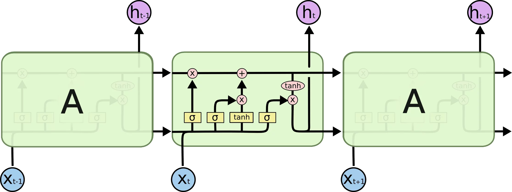
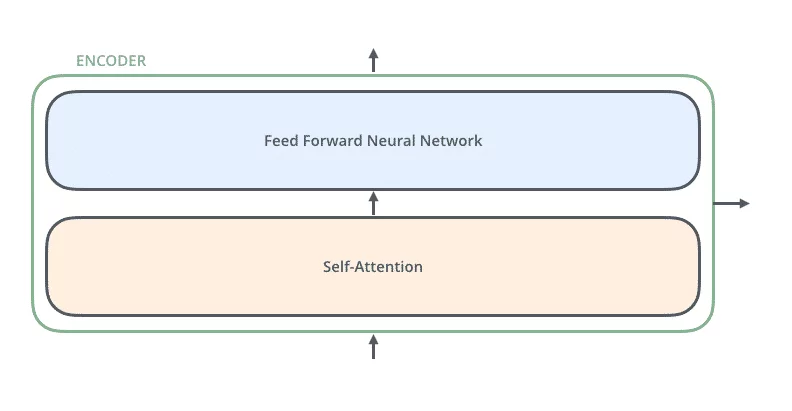
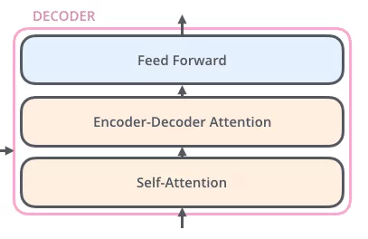
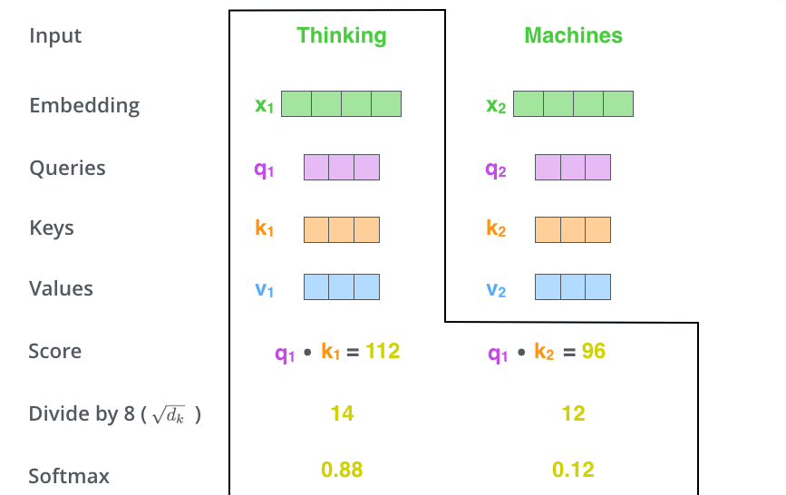

# Tổng quan về Transformer

Transformer là một kiến trúc mạng nơ-ron nhân tạo mang tính đột phá, được giới thiệu vào năm 2017 trong bài báo *"Attention is All You Need"*. Ban đầu được thiết kế cho các bài toán xử lý ngôn ngữ tự nhiên (NLP) như dịch máy, Transformer đã trở thành nền tảng cho các mô hình tiên tiến như BERT, GPT, T5, và nhiều ứng dụng AI khác. Khác với các mô hình truyền thống như RNN hay LSTM, Transformer sử dụng cơ chế **Attention** để xử lý chuỗi dữ liệu một cách song song, cải thiện đáng kể hiệu suất và khả năng nắm bắt mối quan hệ phức tạp trong văn bản. Báo cáo này sẽ trình bày chi tiết cách Transformer hoạt động, các thành phần cốt lõi, quy trình huấn luyện, ứng dụng thực tiễn, và những thách thức liên quan.

## 1. Transformer là gì?

Transformer là một mô hình sequence-to-sequence, được thiết kế để chuyển đổi một chuỗi đầu vào (ví dụ: một câu tiếng Việt) thành một chuỗi đầu ra (ví dụ: câu tiếng Anh). Điểm đặc biệt của Transformer nằm ở việc sử dụng cơ chế **Self-Attention**, cho phép mô hình xử lý toàn bộ chuỗi cùng lúc thay vì tuần tự, giúp:
- Tăng tốc độ huấn luyện nhờ tính toán song song.
- Nắm bắt mối quan hệ giữa các từ trong chuỗi, bất kể khoảng cách giữa chúng.
- Hỗ trợ các bài toán phức tạp trong NLP và hơn thế nữa (như xử lý hình ảnh với Vision Transformer).

Transformer đã được ứng dụng rộng rãi trong các lĩnh vực:
- **Xử lý ngôn ngữ tự nhiên (NLP)**: Dịch máy, tóm tắt văn bản, tạo văn bản, nhận dạng thực thể (NER), hỏi đáp.
- **Trí tuệ nhân tạo tổng quát**: Các mô hình như GPT-3 sử dụng Transformer để thực hiện các tác vụ đa dạng mà không cần tinh chỉnh.
- **Ứng dụng ngoài NLP**: Xử lý hình ảnh (Vision Transformer), âm thanh (WaveNet), và trò chơi (AlphaStar).

Ví dụ, mô hình GPT-2 của OpenAI sử dụng kiến trúc Transformer để tạo văn bản giống con người, trong khi AlphaStar của DeepMind tận dụng Transformer để phân tích chiến lược trong trò chơi StarCraft.

## 2. So sánh Transformer với RNN và LSTM

### 2.1. Recurrent Neural Network (RNN)

RNN được thiết kế để xử lý dữ liệu chuỗi bằng cách duy trì một **trạng thái ẩn** (hidden state) truyền thông tin từ bước thời gian trước sang bước tiếp theo. Cách hoạt động:
- **Kiến trúc**: RNN chứa một vòng lặp, nơi đầu ra của bước trước trở thành đầu vào của bước tiếp theo. Ví dụ, khi xử lý câu "Tôi thích học", RNN sẽ xử lý từng từ ("Tôi", "thích", "học") và truyền trạng thái ẩn qua mỗi bước.
- **Ưu điểm**:
  - Phù hợp với dữ liệu chuỗi có độ dài thay đổi.
  - Có thể lưu giữ thông tin ngữ cảnh qua các bước.
- **Hạn chế**:
  - **Xử lý tuần tự**: RNN phải xử lý từng từ một, không thể tận dụng tính toán song song, dẫn đến thời gian huấn luyện lâu trên chuỗi dài.
  - **Vanishing Gradient**: Khi chuỗi dài, gradient có thể trở nên quá nhỏ, khiến mô hình khó học được các mối quan hệ giữa các từ cách xa nhau. Ví dụ, trong câu "Hồ Chí Minh, người anh hùng dân tộc, đã lãnh đạo...", RNN có thể khó liên kết "Hồ Chí Minh" với "lãnh đạo" do khoảng cách lớn.
  - **Khó khăn với ngữ cảnh xa**: RNN thường ưu tiên thông tin gần hơn, làm mất thông tin từ các từ đầu chuỗi.

### 2.2. Long Short-Term Memory (LSTM)

LSTM là một biến thể cải tiến của RNN, sử dụng **ô nhớ** (memory cell) và các **cổng** (gates: forget, input, output) để kiểm soát luồng thông tin. Cách hoạt động:
- **Kiến trúc**: LSTM quyết định thông tin nào cần giữ lại hoặc quên đi qua các cổng. Ví dụ, trong câu trên, LSTM có thể chọn giữ thông tin về "Hồ Chí Minh" để sử dụng khi xử lý "lãnh đạo".
- **Ưu điểm**:
  - Giải quyết vấn đề vanishing gradient bằng cách duy trì thông tin quan trọng qua chuỗi dài.
  - Có khả năng học các mối quan hệ phức tạp hơn so với RNN.
- **Hạn chế**:
  - **Vẫn tuần tự**: LSTM vẫn xử lý chuỗi theo thứ tự, hạn chế khả năng song song hóa.
  - **Hiệu suất giảm với chuỗi rất dài**: Mặc dù cải tiến hơn RNN, LSTM vẫn gặp khó khăn khi chuỗi vượt quá hàng trăm từ, đặc biệt với các mối quan hệ ngữ cảnh phức tạp.
  - **Chi phí tính toán cao**: LSTM phức tạp hơn RNN, đòi hỏi nhiều tài nguyên hơn.

### 2.3. Transformer vượt trội như thế nào?
Transformer khắc phục các hạn chế của RNN và LSTM thông qua:
- **Tính toán song song**: Thay vì xử lý tuần tự, Transformer sử dụng Self-Attention để xử lý toàn bộ chuỗi cùng lúc, tận dụng tối đa phần cứng như GPU.
- **Nắm bắt mối quan hệ xa**: Self-Attention cho phép mô hình liên kết các từ cách xa nhau mà không cần truyền thông tin qua nhiều bước. Ví dụ, trong câu "Hồ Chí Minh, người anh hùng dân tộc, đã lãnh đạo...", Transformer dễ dàng liên kết "Hồ Chí Minh" với "lãnh đạo".
- **Hiệu quả cao**: Nhờ song song hóa và kiến trúc tối ưu, Transformer huấn luyện nhanh hơn và xử lý được các tập dữ liệu lớn.
- **Linh hoạt**: Transformer không chỉ giới hạn ở NLP mà còn được áp dụng trong các lĩnh vực như thị giác máy tính (Vision Transformer) và xử lý âm thanh.

## 3. Kiến trúc Transformer

Transformer bao gồm hai thành phần chính: **Encoder** (bộ mã hóa) và **Decoder** (bộ giải mã). Mỗi thành phần là một ngăn xếp (stack) gồm nhiều tầng (layer) giống nhau (thường là 6 tầng mỗi bên trong mô hình gốc, nhưng có thể thay đổi tùy mô hình).

### 3.1. Tổng quan kiến trúc
- **Encoder**: Nhận chuỗi đầu vào (ví dụ: câu tiếng Việt) và mã hóa nó thành một tập hợp các biểu diễn (representation) chứa thông tin ngữ cảnh. Encoder phù hợp cho các bài toán yêu cầu hiểu văn bản, như phân loại cảm xúc hoặc nhận dạng thực thể.
- **Decoder**: Sử dụng các biểu diễn từ Encoder và chuỗi đầu ra hiện tại để sinh ra chuỗi đầu ra hoàn chỉnh (ví dụ: câu tiếng Anh). Decoder phù hợp cho các bài toán tạo sinh, như dịch máy hoặc tạo văn bản.
- **Kết nối**: Encoder và Decoder được kết nối thông qua một lớp **Encoder-Decoder Attention**, cho phép Decoder tập trung vào các phần quan trọng của chuỗi đầu vào.

Hình minh họa kiến trúc Transformer:


### 3.2. Encoder

Mỗi tầng Encoder bao gồm hai lớp con chính:
1. **Self-Attention**:
   - Cho phép mỗi từ trong chuỗi đầu vào "chú ý" đến tất cả các từ khác, giúp nắm bắt mối quan hệ ngữ cảnh. Ví dụ, trong câu "Hồ Chí Minh là vị cha già kính yêu", từ "Người" cần chú ý đến "Hồ Chí Minh" để hiểu mối quan hệ đồng nhất.
   - Self-Attention tạo ra một biểu diễn mới cho mỗi từ, kết hợp thông tin từ các từ khác dựa trên mức độ liên quan.
2. **Feed-Forward Neural Network (FNN)**:
   - Áp dụng một mạng nơ-ron truyền thẳng độc lập cho từng từ, tăng khả năng biểu diễn. Mạng này gồm hai tầng tuyến tính với hàm kích hoạt ReLU ở giữa: `FFN(x) = max(0, xW1 + b1)W2 + b2`.
   - Mặc dù áp dụng độc lập, các từ chia sẻ cùng một bộ trọng số, giúp giảm số lượng tham số.

**Các thành phần bổ sung**:
- **Kết nối Residual**: Mỗi lớp con (Self-Attention và FNN) được bao quanh bởi một kết nối residual, nơi đầu vào được cộng trực tiếp vào đầu ra: `Output = LayerNorm(x + Sublayer(x))`. Điều này giúp giảm vấn đề vanishing gradient và cải thiện luồng thông tin.
- **Chuẩn hóa tầng (Layer Normalization)**: Ổn định quá trình huấn luyện bằng cách chuẩn hóa đầu ra của mỗi lớp con theo trung bình và phương sai.

### 3.3. Decoder

Mỗi tầng Decoder có ba lớp con:
1. **Masked Self-Attention**:
   - Tương tự Self-Attention, nhưng chỉ cho phép chú ý đến các từ trước đó trong chuỗi đầu ra (để tránh "nhìn trước" kết quả). Ví dụ, khi sinh từ thứ 4 trong câu đầu ra, Decoder chỉ được sử dụng thông tin từ 3 từ đầu tiên.
   - Masking được thực hiện bằng cách đặt các điểm Attention của các từ tương lai thành -∞ trước khi áp dụng hàm Softmax.
2. **Encoder-Decoder Attention**:
   - Cho phép Decoder tập trung vào các phần quan trọng của chuỗi đầu vào từ Encoder. Ví dụ, khi dịch "Je suis étudiant" sang "I am a student", Decoder sẽ chú ý đến "étudiant" khi sinh từ "student".
   - Lớp này sử dụng các vector Key và Value từ Encoder, trong khi Query đến từ Decoder.
3. **Feed-Forward Neural Network**:
   - Tương tự như trong Encoder, áp dụng mạng truyền thẳng độc lập cho mỗi từ.

Decoder cũng sử dụng kết nối Residual và chuẩn hóa tầng để cải thiện hiệu suất.

### 3.4. Positional Encoding
Vì Transformer không xử lý chuỗi theo thứ tự tuần tự như RNN, nó cần một cách để mã hóa vị trí của các từ. **Positional Encoding** sử dụng các hàm sin và cos để tạo ra các vector vị trí, được cộng vào vector embedding của từ. Điều này giúp mô hình hiểu được thứ tự từ trong chuỗi.

**Công thức Positional Encoding**:
```
PE(pos, 2i) = sin(pos / 10000^(2i/d_model))
PE(pos, 2i+1) = cos(pos / 10000^(2i/d_model))
```
Trong đó:
- `pos`: Vị trí của từ trong chuỗi (bắt đầu từ 0).
- `i`: Chỉ số chiều của vector (từ 0 đến `d_model/2`).
- `d_model`: Kích thước của vector embedding (thường là 512).

**Lý do sử dụng sin và cos**:
- Các hàm này tạo ra các giá trị tuần hoàn, giúp mô hình suy ra vị trí tương đối giữa các từ.
- Mô hình có thể tổng quát hóa cho các chuỗi dài hơn tập huấn luyện nhờ tính chất tuyến tính của sin và cos.

Ví dụ, với `d_model = 4`, Positional Encoding cho từ ở vị trí 0 có thể là:
```
[sin(0/10000^(0/4)), cos(0/10000^(0/4)), sin(0/10000^(2/4)), cos(0/10000^(2/4))] = [0, 1, 0, 1]
```

### 3.5. Self-Attention và Multi-Head Attention
Cơ chế **Self-Attention** là trái tim của Transformer, cho phép mô hình cân nhắc mức độ quan trọng của các từ khác nhau trong chuỗi. Quy trình tính Self-Attention bao gồm các bước sau:

1. **Tạo vector Query, Key, Value**:
   - Mỗi từ được biểu diễn bằng một vector embedding (kích thước `d_model`).
   - Nhân embedding với ba ma trận trọng số (`W_Q`, `W_K`, `W_V`) để tạo ra vector **Query (Q)**, **Key (K)**, và **Value (V)**, mỗi vector có kích thước `d_k` (thường nhỏ hơn `d_model`, ví dụ 64).
   - Công thức: `Q = X * W_Q`, `K = X * W_K`, `V = X * W_V`, trong đó `X` là ma trận embedding của chuỗi.

2. **Tính điểm Attention**:
   - Tính tích vô hướng giữa Query của từ hiện tại và Key của tất cả các từ: `score = Q * K^T`.
   - Chuẩn hóa điểm bằng cách chia cho căn bậc hai của chiều Key (`sqrt(d_k)`) để ổn định độ dốc: `score = (Q * K^T) / sqrt(d_k)`.
   - Áp dụng hàm **Softmax** để chuyển điểm thành xác suất: `attention_weights = softmax(score)`.

3. **Tính đầu ra**:
   - Nhân xác suất với vector Value và cộng lại để tạo ra vector đầu ra cho từ hiện tại: `output = attention_weights * V`.

**Công thức tổng quát**:
```
Attention(Q, K, V) = softmax((Q * K^T) / sqrt(d_k)) * V
```

**Multi-Head Attention** cải tiến Self-Attention bằng cách:
- Chia vector Q, K, V thành `h` "đầu" (head) độc lập (thường `h = 8`).
- Tính Self-Attention riêng cho từng đầu, mỗi đầu có kích thước `d_k = d_model / h`.
- Nối kết quả từ các đầu và áp dụng một ma trận trọng số (`W_O`) để tạo đầu ra cuối cùng: `MultiHead(Q, K, V) = Concat(head_1, ..., head_h) * W_O`.
- **Lợi ích**:
  - Cho phép mô hình nắm bắt nhiều khía cạnh khác nhau của mối quan hệ giữa các từ (ví dụ: ngữ pháp, ngữ nghĩa, quan hệ từ vựng).
  - Tăng tính biểu diễn mà không làm tăng đáng kể chi phí tính toán.

Hình minh họa Self-Attention:



### 3.6. Luồng thông tin trong Transformer
Quá trình xử lý một chuỗi trong Transformer diễn ra như sau:
1. **Đầu vào**:
   - Chuỗi đầu vào (ví dụ: "Tôi thích học") được chuyển thành các vector embedding thông qua một bảng tra cứu từ vựng (word embedding).
   - Thêm Positional Encoding vào embedding để mã hóa vị trí từ.
2. **Encoder**:
   - Chuỗi embedding đi qua các tầng Encoder, mỗi tầng áp dụng Self-Attention và FNN.
   - Đầu ra của Encoder là một tập hợp các vector biểu diễn ngữ cảnh phong phú.
3. **Decoder**:
   - Chuỗi đầu ra (ban đầu có thể là một token đặc biệt `<start>`) được chuyển thành embedding và thêm Positional Encoding.
   - Decoder sử dụng Masked Self-Attention để xử lý chuỗi đầu ra hiện tại, sau đó dùng Encoder-Decoder Attention để kết hợp thông tin từ Encoder.
   - Đầu ra cuối cùng đi qua một tầng tuyến tính và hàm Softmax để dự đoán từ tiếp theo.
4. **Lặp lại**:
   - Decoder sinh từng từ một, thêm từ mới vào chuỗi đầu ra và tiếp tục cho đến khi gặp token đặc biệt `<end>`.

## 4. Quy trình huấn luyện Transformer

Huấn luyện Transformer là một quá trình phức tạp, bao gồm hai giai đoạn chính: **huấn luyện trước (pre-training)** và **tinh chỉnh (fine-tuning)**.

### 4.1. Huấn luyện trước (Pre-training)
- **Mục tiêu**: Học biểu diễn ngôn ngữ chung từ một lượng lớn dữ liệu thô (ví dụ: văn bản từ internet, sách, bài báo).
- **Phương pháp**:
  - **Học tự giám sát (Self-Supervised Learning)**: Mô hình được huấn luyện mà không cần nhãn do con người cung cấp. Thay vào đó, mục tiêu được tạo tự động từ dữ liệu.
  - **Mô hình ngôn ngữ nhân quả (Causal Language Modeling)**: Dự đoán từ tiếp theo trong chuỗi dựa trên các từ trước đó. Ví dụ, với câu "Tôi thích học", mô hình học dự đoán "học" từ "Tôi thích".
  - **Mô hình ngôn ngữ che dấu (Masked Language Modeling)**: Che ngẫu nhiên một số từ trong câu và yêu cầu mô hình dự đoán chúng. Ví dụ, với câu "Tôi [MASK] học", mô hình phải đoán từ bị che là "thích".
- **Dữ liệu**: Các tập dữ liệu lớn như Wikipedia, Common Crawl, hoặc BookCorpus.
- **Chi phí**: Huấn luyện trước đòi hỏi tài nguyên tính toán khổng lồ, thường kéo dài vài tuần trên hàng trăm GPU.

### 4.2. Tinh chỉnh (Fine-tuning)
- **Mục tiêu**: Điều chỉnh mô hình đã huấn luyện trước cho một bài toán cụ thể (ví dụ: dịch máy, phân loại cảm xúc).
- **Phương pháp**:
  - **Học có giám sát (Supervised Learning)**: Sử dụng dữ liệu có nhãn (ví dụ: cặp câu tiếng Việt - tiếng Anh cho dịch máy).
  - Huấn luyện mô hình trên tập dữ liệu nhỏ hơn, với các tham số được khởi tạo từ mô hình huấn luyện trước.
- **Lợi ích**:
  - Tận dụng kiến thức ngôn ngữ chung từ huấn luyện trước, giảm nhu cầu dữ liệu có nhãn.
  - Thời gian huấn luyện ngắn hơn và chi phí thấp hơn so với huấn luyện từ đầu.
- **Ví dụ**: Tinh chỉnh BERT để phân loại cảm xúc bằng cách thêm một tầng phân loại vào đầu ra của Encoder và huấn luyện trên dữ liệu có nhãn như "Tích cực" hoặc "Tiêu cực".

### 4.3. Hàm mất mát (Loss Function)
- **Cross-Entropy Loss**: Được sử dụng để đo lường sự khác biệt giữa phân phối xác suất dự đoán của mô hình và nhãn đúng. Ví dụ, khi dịch "merci" sang "thanks", mô hình cần tối ưu để xác suất của "thanks" là cao nhất.
- **Kullback-Leibler Divergence**: Đôi khi được sử dụng để so sánh phân phối xác suất, đặc biệt trong các bài toán tinh chỉnh.

### 4.4. Tối ưu hóa
- **Bộ tối ưu**: Adam hoặc AdamW thường được sử dụng nhờ khả năng xử lý gradient hiệu quả.
- **Lập lịch học (Learning Rate Scheduling)**: Sử dụng lịch học warmup (tăng dần learning rate ở đầu) và decay (giảm dần về cuối) để ổn định huấn luyện.
- **Batch Size**: Các batch lớn (256-2048) thường được sử dụng để tận dụng tính toán song song.

## 5. Ứng dụng thực tiễn của Transformer

Transformer đã được triển khai trong nhiều bài toán NLP thông qua thư viện **🤗 Transformers** của Hugging Face. Dưới đây là các ví dụ chi tiết sử dụng hàm `pipeline()`:

### 5.1. Phân tích cảm xúc (Sentiment Analysis)

### 5.2. Tạo văn bản (Text Generation)

### 5.3. Dịch máy (Translation)

### 5.4. Nhận dạng thực thể (Named Entity Recognition - NER)

### 5.5. Điền chỗ trống (Fill-Mask)

### 5.6. Hỏi đáp (Question Answering)

### 5.7. Tóm tắt văn bản (Summarization)
**Link tham khảo:** https://huggingface.co/learn/llm-course/vi/chapter1/3?fw=pt

## 6. Các biến thể của Transformer

Transformer đã truyền cảm hứng cho nhiều mô hình tiên tiến, được chia thành ba nhóm chính:

### 6.1. Mô hình chỉ dùng Encoder (Auto-Encoding)
- **Đặc điểm**:
  - Chỉ sử dụng phần Encoder của Transformer.
  - Self-Attention là "hai chiều" (bidirectional), cho phép chú ý đến toàn bộ chuỗi đầu vào.
  - Huấn luyện trước bằng cách che ngẫu nhiên một số từ và yêu cầu mô hình dự đoán (Masked Language Modeling).
- **Ví dụ**:
  - **BERT (Bidirectional Encoder Representations from Transformers)**: Được huấn luyện để hiểu ngữ cảnh hai chiều, phù hợp cho phân loại, NER, hỏi đáp.
  - **RoBERTa**: Cải tiến BERT với dữ liệu huấn luyện lớn hơn và tối ưu hóa tốt hơn.
  - **DistilBERT**: Phiên bản nhẹ của BERT, nhanh hơn 60% và giữ 97% hiệu suất.
- **Ứng dụng**: Phân loại câu, nhận dạng thực thể, trả lời câu hỏi chiết xuất.

### 6.2. Mô hình chỉ dùng Decoder (Auto-Regressive)
- **Đặc điểm**:
  - Chỉ sử dụng phần Decoder của Transformer.
  - Self-Attention là "một chiều" (causal), chỉ chú ý đến các từ trước đó trong chuỗi.
  - Huấn luyện trước bằng cách dự đoán từ tiếp theo (Causal Language Modeling).
- **Ví dụ**:
  - **GPT (Generative Pre-trained Transformer)**: Thế hệ đầu tiên, tập trung vào tạo văn bản.
  - **GPT-2**: Phiên bản lớn hơn, có khả năng tạo văn bản giống con người.
  - **GPT-3**: Mô hình cực lớn với 175 tỷ tham số, hỗ trợ zero-shot learning.
- **Ứng dụng**: Tạo văn bản, đối thoại, hoàn thành câu.

### 6.3. Mô hình Encoder-Decoder (Sequence-to-Sequence)
- **Đặc điểm**:
  - Sử dụng cả Encoder và Decoder.
  - Phù hợp cho các bài toán cần chuyển đổi chuỗi đầu vào thành chuỗi đầu ra.
  - Huấn luyện trước bằng các mục tiêu phức tạp, như thay thế đoạn văn bản bằng token đặc biệt và dự đoán đoạn bị thay thế.
- **Ví dụ**:
  - **T5 (Text-to-Text Transfer Transformer)**: Xem mọi bài toán NLP như một bài toán text-to-text, ví dụ: dịch máy, tóm tắt, hỏi đáp.
  - **BART**: Kết hợp huấn luyện che dấu và tái tạo chuỗi, tốt cho tóm tắt và dịch máy.
  - **Marian**: Tối ưu cho dịch máy với tốc độ cao.
- **Ứng dụng**: Dịch máy, tóm tắt, hỏi đáp tổng hợp.

## 7. Tối ưu hóa và mở rộng Transformer

Để cải thiện hiệu suất và khả năng mở rộng, Transformer đã được tối ưu hóa qua nhiều cách:

### 7.1. Kỹ thuật tối ưu hóa
- **Sparse Attention**: Giảm chi phí tính toán bằng cách chỉ tính Attention cho một tập hợp con các từ thay vì toàn bộ chuỗi. Ví dụ, Longformer sử dụng Sparse Attention để xử lý chuỗi dài hàng nghìn từ.
- **Quantization**: Giảm độ chính xác của trọng số (từ float32 xuống int8) để tăng tốc độ suy luận và giảm bộ nhớ.
- **Distillation**: Tạo các mô hình nhỏ hơn (như DistilBERT) từ các mô hình lớn, giữ hiệu suất cao nhưng nhẹ hơn.

### 7.2. Mô hình lớn hơn
- Các mô hình như GPT-3 (175 tỷ tham số) và PaLM (540 tỷ tham số) cho thấy hiệu suất tăng theo kích thước mô hình và dữ liệu huấn luyện.
- Tuy nhiên, mô hình lớn đòi hỏi chi phí tính toán khổng lồ và có tác động môi trường đáng kể.

### 7.3. Ứng dụng ngoài NLP
- **Vision Transformer (ViT)**: Áp dụng Transformer cho hình ảnh bằng cách chia ảnh thành các "patch" và xử lý chúng như chuỗi.
- **Audio Transformer**: Sử dụng Transformer để xử lý âm thanh, như trong WaveNet hoặc Whisper (dịch giọng nói).
- **Reinforcement Learning**: Transformer được dùng để phân tích chiến lược trong các trò chơi như AlphaStar.

## 8. Hạn chế và Thiên kiến

Mặc dù mạnh mẽ, Transformer có một số hạn chế cần lưu ý:

### 8.1. Thiên kiến
- **Nguồn dữ liệu**: Transformer thường được huấn luyện trên dữ liệu internet lớn, chứa cả nội dung tích cực và tiêu cực. Điều này dẫn đến thiên kiến về giới tính, chủng tộc, hoặc văn hóa.
- **Ví dụ**: Khi sử dụng mô hình BERT cho tác vụ điền chỗ trống:
  ```python
  unmasker = pipeline("fill-mask", model="bert-base-uncased")
  print(unmasker("This man works as a [MASK].")[:2])
  print(unmasker("This woman works as a [MASK].")[:2])
  # Man: ['lawyer', 'doctor']
  # Woman: ['nurse', 'teacher']
  ```
  Kết quả cho thấy mô hình liên kết "man" với các nghề như "lawyer", trong khi "woman" thường gắn với "nurse", phản ánh thiên kiến giới tính.

### 8.2. Chi phí tính toán
- Huấn luyện các mô hình lớn như GPT-3 đòi hỏi hàng triệu USD và hàng nghìn GPU, gây ra lượng khí thải carbon đáng kể.
- Suy luận (inference) trên các mô hình lớn cũng tốn kém, đặc biệt trong các ứng dụng thời gian thực.

### 8.3. Khả năng tổng quát hóa
- Mô hình có thể gặp khó khăn với các ngôn ngữ hoặc ngữ cảnh ít được huấn luyện, ví dụ: các ngôn ngữ thiểu số.
- Trong các bài toán phức tạp, Transformer có thể tạo ra kết quả không chính xác hoặc "ảo giác" (hallucination), ví dụ: sinh văn bản sai sự thật.

### 8.4. Giải thích kết quả
- Transformer hoạt động như một "hộp đen", khó giải thích tại sao mô hình đưa ra một dự đoán cụ thể. Điều này gây khó khăn trong các ứng dụng yêu cầu độ tin cậy cao, như y tế hoặc pháp luật.

## 9. Kết luận

Transformer đã cách mạng hóa lĩnh vực xử lý ngôn ngữ tự nhiên và trí tuệ nhân tạo nhờ vào cơ chế Attention và khả năng xử lý song song. Với kiến trúc linh hoạt, nó là nền tảng cho các mô hình tiên tiến như BERT, GPT, T5, và được áp dụng trong nhiều lĩnh vực từ dịch máy đến xử lý hình ảnh. Tuy nhiên, các hạn chế như thiên kiến, chi phí tính toán, và khó khăn trong giải thích đòi hỏi sự cẩn trọng khi triển khai. Việc sử dụng các công cụ như Hugging Face Transformers giúp dễ dàng áp dụng Transformer vào thực tiễn, mở ra cơ hội cho các nhà phát triển và nhà nghiên cứu.